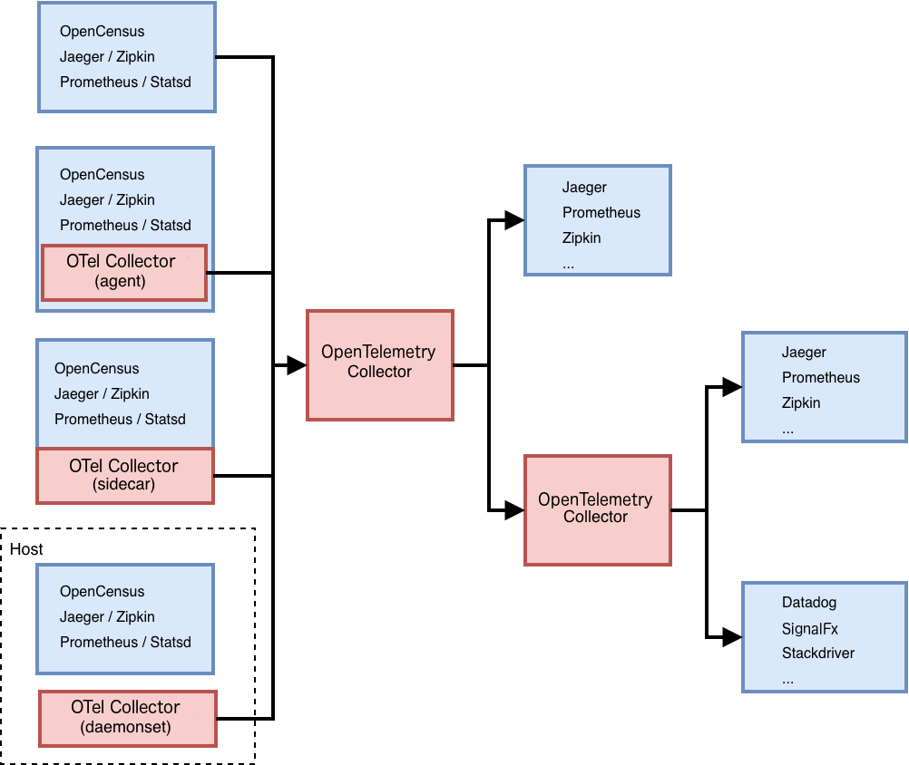

# OpenTelemetry Collector

[![Build Status][travis-image]][travis-url]
[![GoDoc][godoc-image]][godoc-url]
[![Gitter chat][gitter-image]][gitter-url]
[![Coverage Status][codecov-image]][codecov-url]

We hold regular meetings. See details at [community page](https://github.com/open-telemetry/community#agentcollector).

**Table of contents:**

- [Introduction](#introduction)
- [Deployment](#deploy)
- [Getting Started](#getting-started)
  - [Demo](#getting-started-demo)
  - [Kubernetes](#getting-started-k8s)
  - [Standalone](#getting-started-standalone)
- [Configuration](#config)
  - [Receivers](#config-receivers)
  - [Processors](#config-processors)
  - [Exporters](#config-exporters)
  - [Extensions](#config-extensions)
  - [Service](#config-service)
- [Other Information]
  - [Extending the Collector](#extending-the-collector)
  - [Owners](#owners)

## Introduction

The OpenTelemetry Collector can receive traces and metrics from processes
instrumented by OpenTelemetry or other monitoring/tracing libraries (e.g. Jaeger,
Prometheus, etc.), can pre-process received data including adding or removing
attributes, handles aggregation and smart sampling, and exports traces
and metrics to one or more open-soource or commercial monitoring/tracing
backends.

Some frameworks and ecosystems are now providing out-of-the-box instrumentation
by using OpenTelemetry, but the user is still expected to register an exporter
to send data. This is a problem during an incident. Even though users can
benefit from having more diagnostics data coming out of services already
instrumented with OpenTelemetry, they have to modify their code to register an
exporter and redeploy. Asking users to recompile and redeploy is not ideal
during an incident. In addition, current users need to decide which service
backend they want to export to before they distribute their binary instrumented
by OpenTelemetry.

The OpenTelemetry Collector is trying to eliminate these requirements. With the
OpenTelemetry Collector, users do not need to redeploy or restart their
applications as long as it has the OpenTelemetry exporter. All they need to do
is configure and deploy the OpenTelemetry Collector separately. The
OpenTelemetry Collector will then automatically receive traces and metrics and
export to any backend of the user's choice.

Some supplemental documents to review include:

* [design.md](docs/design.md)
* [performance.md](docs/performance.md)
* [vision.md](docs/vision.md)

## <a name="deploy"></a>Deployment

The OpenTelemetry Collector can be deployed in a variety of different ways
depending on requirements. Currently, the OpenTelemetry Collector consists of a
single binary and two deployment methods:

1. An agent running with the application or on the same host as the application
(e.g. binary, sidecar, or daemonset)
2. A collector running as a standalone service (e.g. container or deployment)

While the same binary is used for either deployment method, the configuration
between the two may differ depending on requirements (e.g. queue size and
feature-set enabled).



## <a name="getting-started"></a>Getting Started

### <a name="getting-started-demo"></a>Demo

Instructions for setting up an end-to-end demo environment can be found
[here](examples/demo)

### <a name="getting-started-k8s"></a>Kubernetes

Apply the [sample YAML](examples/k8s.yaml) file:

```shell
$ kubectl apply -f example/k8s.yaml
```

### <a name="getting-started-standalone"></a>Standalone

Create an Agent [configuration](#config) file based on the example below.
Build the Agent and start it with the example configuration:

```shell
$ ./bin/$(go env GOOS)/otelcol  --config ./examples/demo/otel-agent-config.yaml
$ 2018/10/08 21:38:00 Running OpenTelemetry receiver as a gRPC service at "localhost:55678"
```

Create a Collector [configuration](#config) file based on the example below.
Build the Collector and start it with the example configuration:

```shell
$ make otelcol
$ ./bin/$($GOOS)/otelcol --config ./examples/demo/otel-collector-config.yaml
```

Run the demo application:

```shell
$ go run "$(go env GOPATH)/src/github.com/open-telemetry/opentelemetry-collector/examples/main.go"
```

You should be able to see the traces in your exporter(s) of choice. If you stop
`otelcol`, the example application will stop exporting. If you run it again,
exporting will resume.

## <a name="config"></a>Configuration

The OpenTelemetry Collector is configured via a YAML file.
In general, at least one enabled receiver and one enabled exporter
needs to be configured.

The configuration consists of the following sections:

```yaml
receivers:
  ...
processors:
  ...
exporters:
  ...
extensions:
  ...
service:
  ...
```

### <a name="config-receivers"></a>Receivers

A receiver is how data gets into the OpenTelemetry Collector. One or more receivers
must be configured. By default, no receivers are configured.

A basic example of all available receivers is provided below.
For detailed receiver configuration, please see the [receiver
README.md](receiver/README.md).

```yaml
receivers:
  opencensus:
    address: "localhost:55678"

  zipkin:
    address: "localhost:9411"

  jaeger:
    protocols:
      grpc:
      thrift_http:
      thrift_tchannel:
      thrift_compact:
      thrift_binary:

  prometheus:
    config:
      scrape_configs:
        - job_name: "caching_cluster"
          scrape_interval: 5s
          static_configs:
            - targets: ["localhost:8889"]
```

### <a name="config-processors"></a>Processors

Processors are run on data between being received and being exported.
Processors are optional though some are recommended.

A basic example of all available processors is provided below. For
detailed processor configuration, please see the [processor
README.md](processor/README.md).

```yaml
processors:
  attributes/example:
    actions:
      - key: db.statement
        action: delete
  batch:
    timeout: 5s
    send_batch_size: 1024
  probabilistic_sampler:
    disabled: true
  span:
    name:
      from_attributes: ["db.svc", "operation"]
      separator: "::"
  queued_retry: {}
  tail_sampling:
    policies:
      - name: policy1
        type: rate_limiting
        rate_limiting:
          spans_per_second: 100
```

### <a name="config-exporters"></a>Exporters

An exporter is how you send data to one or more backends/destinations. One or
more exporters must be configured. By default, no exporters are configured.

A basic example of all available exporters is provided below. For detailed
exporter configuration, please see the [exporter
README.md](exporter/README.md).

```yaml
exporters:
  opencensus:
    headers: {"X-test-header": "test-header"}
    compression: "gzip"
    cert_pem_file: "server-ca-public.pem" # optional to enable TLS
    endpoint: "localhost:55678"
    reconnection_delay: 2s

  logging:
    loglevel: debug

  jaeger_grpc:
    endpoint: "http://localhost:14250"

  jaeger_thrift_http:
    headers: {"X-test-header": "test-header"}
    timeout: 5
    url: "http://localhost:14268/api/traces"

  zipkin:
    url: "http://localhost:9411/api/v2/spans"

  prometheus:
    endpoint: "localhost:8889"
    namespace: "default"
```

### <a name="config-extensions"></a>Extensions

Extensions are provided to monitor the health of the OpenTelemetry
Collector. Extensions are optional. By default, no extensions are configured.

A basic example of all available extensions is provided below. For detailed
extension configuration, please see the [extension
README.md](extension/README.md).

```yaml
extensions:
  health_check: {}
  pprof: {}
  zpages: {}
```

### <a name="config-service"></a>Service

The service section is used to configure what features are enabled in the
OpenTelemetry Collector based on the configuration found in the receivers,
processors, exporters, and extensions sections. The service section
consists of two sub-sections:

* extensions
* pipelines

Extensions consist of a list of all extensions to enable. For example:

```yaml
    service:
      extensions: [health_check, pprof, zpages]
```

Pipelines can be of two types:

* metrics: collects and processes metrics data.
* traces: collects and processes trace data.

A pipeline consists of a set of receivers, processors, and exporters. Each
receiver/processor/exporter must be specified in the configuration to be
included in a pipeline and each receiver/processor/exporter can be used in more
than one pipeline.

*Note:* For processor(s) referenced in multiple pipelines, each pipeline will
get a separate instance of that processor(s). This is in contrast to
receiver(s)/exporter(s) referenced in multiple pipelines, where only one
instance of a receiver/exporter is used for all pipelines.

The following is an example pipeline configuration. For more information, refer
to [pipeline documentation](docs/pipelines.md).

```yaml
service:
  pipelines:
    traces:
      receivers: [opencensus, jaeger]
      processors: [batch, queued_retry]
      exporters: [opencensus, zipkin]
```

## Other Information

### Extending the Collector

The OpenTelemetry collector can be extended or embedded into other applications.

The list of applications extending the collector:

* [opentelemetry-collector-contrib](https://github.com/open-telemetry/opentelemetry-collector-contrib)
* [jaeger-opentelemetry-collector](https://github.com/jaegertracing/jaeger-opentemenetry-collector)

### Owners

Approvers ([@open-telemetry/collector-approvers](https://github.com/orgs/open-telemetry/teams/collector-approvers)):

- [Owais Lone](https://github.com/owais), Splunk
- [Rahul Patel](https://github.com/rghetia), Google
- [Steve Flanders](https://github.com/flands), Splunk
- [Steven Karis](https://github.com/sjkaris), Splunk
- [Yang Song](https://github.com/songy23), Google

*Find more about the approver role in [community repository](https://github.com/open-telemetry/community/blob/master/community-membership.md#approver).*

Maintainers ([@open-telemetry/collector-maintainers](https://github.com/orgs/open-telemetry/teams/collector-maintainers)):

- [Bogdan Drutu](https://github.com/BogdanDrutu), Splunk
- [Paulo Janotti](https://github.com/pjanotti), Splunk
- [Tigran Najaryan](https://github.com/tigrannajaryan), Splunk

*Find more about the maintainer role in [community repository](https://github.com/open-telemetry/community/blob/master/community-membership.md#maintainer).*

[travis-image]: https://travis-ci.org/open-telemetry/opentelemetry-collector.svg?branch=master
[travis-url]: https://travis-ci.org/open-telemetry/opentelemetry-collector
[godoc-image]: https://godoc.org/github.com/open-telemetry/opentelemetry-collector?status.svg
[godoc-url]: https://godoc.org/github.com/open-telemetry/opentelemetry-collector
[gitter-image]: https://badges.gitter.im/open-telemetry/opentelemetry-collector.svg
[gitter-url]: https://gitter.im/open-telemetry/opentelemetry-collector?utm_source=badge&utm_medium=badge&utm_campaign=pr-badge&utm_content=badge
[codecov-image]: https://codecov.io/gh/open-telemetry/opentelemetry-collector/branch/master/graph/badge.svg
[codecov-url]: https://codecov.io/gh/open-telemetry/opentelemetry-collector/branch/master/
