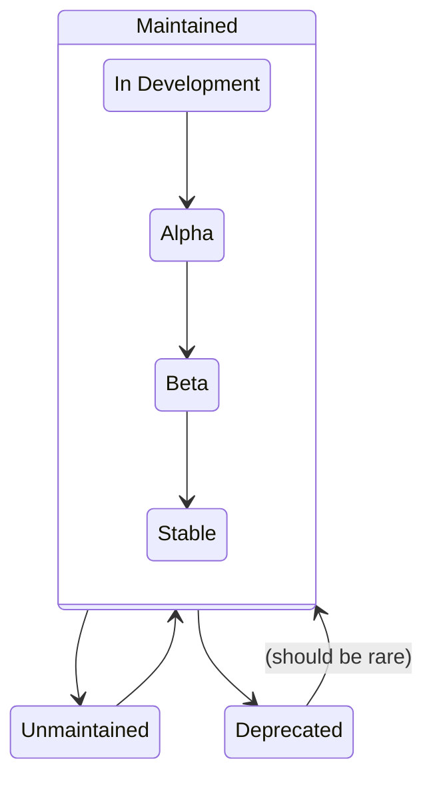

# Stability Levels and versioning

## Stability levels

The Collector components and implementation are in different stages of stability, and usually split between
functionality and configuration. While we intend to provide high-quality components as part of this repository,
we acknowledge that not all of them are ready for prime time. Moreover, the stability of components that can
handle multiple signals can depend on the signal in question.

As such, each component should list its current stability level for each telemetry signal in its README file, according to
the following definitions:

### Development

Not all pieces of the component are in place yet and it might not be available as part of any distributions yet. Bugs and performance issues should be reported, but it is likely that the component owners might not give them much attention. Your feedback is still desired, especially when it comes to the user-experience (configuration options, component observability, technical implementation details, ...). Configuration options might break often depending on how things evolve. The component should not be used in production.

### Alpha

The component is ready to be used for limited non-critical workloads and the authors of this component would welcome your feedback. Bugs and performance problems should be reported, but component owners might not work on them right away.

#### Configuration changes

Configuration for alpha components can be changed with minimal notice. Documenting them as part of the changelog is
sufficient. We still recommend giving users one or two minor versions' notice before breaking the configuration, such as
when removing or renaming a configuration option. Providing a migration path in the component's repository is NOT
required for alpha components, although it is still recommended.

- when adding a new configuration option, components MAY mark the new option as required and are not required to provide
  a reasonable default.
- when renaming a configuration option, components MAY treat the old name as an alias to the new one and log a WARN
  level message in case the old option is being used.
- when removing a configuration option, components MAY keep the old option for a few minor releases and log a WARN level
  message instructing users to remove the option.

#### Documentation requirements

Alpha components should document how to use them in the most common situations, including:
- One or more example configuration snippets for the most common use cases.

### Beta

Same as Alpha, but the configuration options are deemed stable. While there might be breaking changes between releases, component owners should try to minimize them. A component at this stage is expected to have had exposure to non-critical production workloads already during its **Alpha** phase, making it suitable for broader usage.

#### Configuration changes

Backward incompatible changes should be rare events for beta components. Users of those components are not expecting to
have their Collector instances failing at startup because of a configuration change. When doing backward incompatible
changes, component owners should add the migration path to a place within the component's repository, linked from the
component's main README. This is to ensure that people using older instructions can understand how to migrate to the
latest version of the component.

When adding a new required option:
- the option MUST come with a sensible default value

When renaming or removing a configuration option:
- the option MUST be deprecated in one version
- a WARN level message should be logged, with a link to a place within the component's repository where the change is
  documented and a migration path is provided
- the option MUST be kept for at least N+1 version and MAY be hidden behind a feature gate in N+2
- the option and the WARN level message MUST NOT be removed earlier than N+2 or 6 months, whichever comes later

Additionally, when removing an option:
- the option MAY be made non-operational already by the same version where it is deprecated

#### Documentation requirements

Beta components should have a set of documentation that documents its usage in most cases,
including:
- One or more example configuration snippets for the most common use cases.
- Advanced configuration options that are known to be used in common environments.
- All component-specific feature gates including a description for them and when they should be
  used.
- Warnings about known limitations and ways to misuse the component.

Receivers that produce a fixed set of telemetry should document the telemetry they produce,
including:
- For all signals, the resource attributes that are expected to be present in telemetry.
- For metrics, the name, description, type, units and attributes of each metric.

### Stable

The component is ready for general availability. Bugs and performance problems should be reported and there's an expectation that the component owners will work on them. Breaking changes, including configuration options and the component's output are not expected to happen without prior notice, unless under special circumstances.

#### Configuration changes

Stable components MUST be compatible between minor versions unless critical security issues are found. In that case, the
component owner MUST provide a migration path and a reasonable time frame for users to upgrade. The same rules from beta
components apply to stable when it comes to configuration changes.

#### Testing requirements

Stable components MUST have a comprehensive test suite. In particular they MUST have:
1. A **test coverage** that exceeds the highest between 80% coverage and the repository-wide
minimum. The unit test suite SHOULD cover all configuration options. The coverage MUST be shown as
part of the component documentation.
2. At least one **lifecycle test** that tests the component's initialization with a valid
   configuration and ensures proper context propagation if applicable.
3. At least one **benchmark test** for each stable signal. The component's documentation MUST
   include a link to the latest run of benchmark results.

#### Documentation requirements

Stable components should have a complete set of documentation, including:
- One or more example configuration snippets for the most common use cases.
- All configuration options supported by the component and a description for each of them.
- All component-specific feature gates including a description for them and when they should be
  used.
- All component-specific self-observability features that are not available for other components and
  what they provide.
- Compatibility guarantees with external dependencies including the versions it is compatible with
  and under what conditions.
- Guidance related to the component's usage in production environments, including how to scale a deployment of this component properly if it needs special considerations.
- If stateful, how to configure the component to use persistent storage and how to gracefully
  shutdown and restart the component.
- Warnings about known limitations and ways to misuse the component.

Receivers that produce a fixed set of telemetry should document the telemetry they produce,
including:
- For all signals, the resource attributes that are expected to be present in telemetry.
- For metrics, the name, description, type, units and attributes of each metric.

#### Observability requirements

Stable components should emit enough internal telemetry to let users detect errors, as well as data
loss and performance issues inside the component, and to help diagnose them if possible.

For extension components, this means some way to monitor errors (for example through logs or span
events), and some way to monitor performance (for example through spans or histograms). Because
extensions can be so diverse, the details will be up to the component authors, and no further
constraints are set out in this document.

For pipeline components however, this section details the kinds of values that should be observable
via internal telemetry for all stable components.

> [!NOTE]
> - The following categories MUST all be covered, unless justification is given as to why one may
>   not be applicable.
> - However, for each category, many reasonable implementations are possible, as long as the
>   relevant information can be derived from the emitted telemetry; everything after the basic
>   category description is a recommendation, and is not normative.
> - Of course, a component may define additional internal telemetry which is not in this list.
> - Some of this internal telemetry may already be provided by pipeline auto-instrumentation or
>   helper modules (such as `receiverhelper`, `scraperhelper`, `processorhelper`, or
>   `exporterhelper`). Please check the documentation to verify which parts, if any, need to be
>   implemented manually.

**Definition:** In the following, an "item" refers generically to a single log record, metric point,
or span.

The internal telemetry of a stable pipeline component should allow observing the following:

1. How much data the component receives.

    For receivers, this could be a metric counting requests, received bytes, scraping attempts, etc.

    For other components, this would typically be the number of items received through the
    `Consumer` API.

2. How much data the component outputs.

    For exporters, this could be a metric counting requests, sent bytes, etc.

    For other components, this would typically be the number of items forwarded to the next
    component through the `Consumer` API.

3. How much data is dropped because of errors.

    For receivers, this could include a metric counting payloads that could not be parsed in.

    For receivers and exporters that interact with an external service, this could include a metric
    counting requests that failed because of network errors.

    For processors, this could be an `outcome` (`success` or `failure`) attribute on a "received
    items" metric defined for point 1.

    The goal is to be able to easily pinpoint the source of data loss in the Collector pipeline, so
    this should either:
    - only include errors internal to the component, or;
    - allow distinguishing said errors from ones originating in an external service, or propagated
        from downstream Collector components.

4. Details for error conditions.

    This could be in the form of logs or spans detailing the reason for an error. As much detail as
    necessary should be provided to ease debugging. Processed signal data should not be included for
    security and privacy reasons.

5. Other possible discrepancies between input and output, if any. This may include:

    - How much data is dropped as part of normal operation (eg. filtered out).

    - How much data is created by the component.

    - How much data is currently held by the component, and how much can be held if there is a fixed
        capacity.
    
        This would typically be an UpDownCounter keeping track of the size of an internal queue, along
        with a gauge exposing the queue's capacity.

6. Processing performance.

    This could include spans for each operation of the component, or a histogram of end-to-end
    component latency.
    
    The goal is to be able to easily pinpoint the source of latency in the Collector pipeline, so
    this should either:
    - only include time spent processing inside the component, or;
    - allow distinguishing this latency from that caused by an external service, or from time spent
        in downstream Collector components.
    
    As an application of this, components which hold items in a queue should allow differentiating
    between time spent processing a batch of data and time where the batch is simply waiting in the
    queue.
    
    If multiple spans are emitted for a given batch (before and after a queue for example), they
    should either belong to the same trace, or have span links between them, so that they can be
    correlated.

When measuring amounts of data, it is recommended to use "items" as your unit of measure. Where this
can't easily be done, any relevant unit may be used, as long as zero is a reliable indicator of the
absence of data. In any case, all metrics should have a defined unit (not "1").

All internal telemetry emitted by a component should have attributes identifying the specific
component instance that it originates from. This should follow the same conventions as the
[pipeline universal telemetry](rfcs/component-universal-telemetry.md).

If data can be dropped/created/held at multiple distinct points in a component's pipeline (eg.
scraping, validation, processing, etc.), it is recommended to define additional attributes to help
diagnose the specific source of the discrepancy, or to define different signals for each.

The breakdown of emitted telemetry per telemetry level (basic / normal / detailed) should follow
the guidelines in [the Go package documentation for `configtelemetry`](/config/configtelemetry/doc.go).

### Deprecated

The component is planned to be removed in a future version and no further support will be provided. Note that new issues will likely not be worked on. When a component enters "deprecated" mode, it is expected to exist for at least two minor releases. See the component's readme file for more details on when a component will cease to exist.

### Unmaintained

A component identified as unmaintained does not have an active code owner. Such component may have never been assigned a code owner or a previously active code owner has not responded to requests for feedback within 6 weeks of being contacted. Issues and pull requests for unmaintained components will be labelled as such. After 3 months of being unmaintained, these components will be removed from official distribution. Components that are unmaintained are actively seeking contributors to become code owners.

Components that were accepted based on being vendor-specific components will be marked as unmaintained if
they have no active code owners from the vendor even if there are other code owners listed. As part of being marked unmaintained, we'll attempt to contact the vendor to notify them of the change. Other active code
owners may petition for its continued maintenance if they want, at which point the component will no
longer be considered vendor-specific.

## Moving between stability levels

Components can move between stability levels. The valid transitions are described in the following diagram:

To move within the 'Maintained' ladder ("graduate"), the process for doing so is as follows:

1. One of the component owners should file an issue with the 'Graduation' issue template to request
   the graduation.
2. An approver is assigned in a rotating basis to evaluate the request and provide feedback. For
   vendor specific components, the approver should be from a different employer to the one owning
   the component.
3. If approved, a PR to change the stability level should be opened and MUST be approved by all
   listed code owners.

## Graduation criteria

In addition to the requirements outlined above, additional criteria should be met before a component
can graduate to a higher stability level. These ensure that the component is ready for the increased
usage and scrutiny that comes with a higher stability level, and that the community around it is
sufficiently healthy.

If the graduation criteria are not met, the approver should provide feedback on what is missing and
how to address it. The component owners can then address the feedback and re-request graduation on
the same issue.

## In development to alpha

No additional criteria are required to graduate from development to alpha.
The component still needs to meet the general requirements for alpha components.

## Alpha to beta

To graduate any signal from alpha to beta on a component:
1. The component MUST have at least two active code owners.
3. Within the 30 days prior to the graduation request, the code owners MUST have reviewed and
   replied to at least 80% of the issues and pull requests opened against the component. This
   excludes general PRs or issues that are not specific to the component itself (e.g. repo-wide API
   updates). It is not necessary that the issues and PRs are closed or merged, but that they have
   been reviewed and replied to appropriately.

## Beta to stable

To graduate any signal from beta to stable on a component:
1. The component MUST have at least three active code owners.
2. The component benchmark results MUST have been updated within the last 30 days and published in the component's README.
3. Within the 60 days prior to the graduation request, the code owners MUST have reviewed and
   replied to at least 80% of the issues and pull requests opened against the component. This
   excludes general PRs or issues that are not specific to the component itself (e.g. repo-wide API
   updates). It is not necessary that the issues and PRs are closed or merged, but that they have
   been reviewed and replied to appropriately.

## Deprecation Information

When a component is moved to deprecated, a deprecation section should indicate the date it was deprecated
as well as any migration guidance. In some occasions might not be offered migration guidance but reviewers should
explicitly agree on this, and use a "No migration is offered for this component" hint.

## Versioning

For a component to be marked as 1.x it MUST be stable for at least one signal.
Even if a component has a 1.x or greater version, its behavior for specific signals might change in ways that break end users if the component is not stable for a particular signal.

However, components are Go modules and as such follow [semantic versioning](https://semver.org/). Go API stability guarantees are covered in the [VERSIONING.md](../VERSIONING.md) document.
The versioning of a component, and the Go API stability guarantees that come with it, apply to ALL signals simultaneously, regardless of their stability level.
This means that, once a component is marked as 1.x, signal-specific configuration options MUST NOT be removed or changed in a way that breaks our Go API compatibility promise, even if the signal is not stable.
