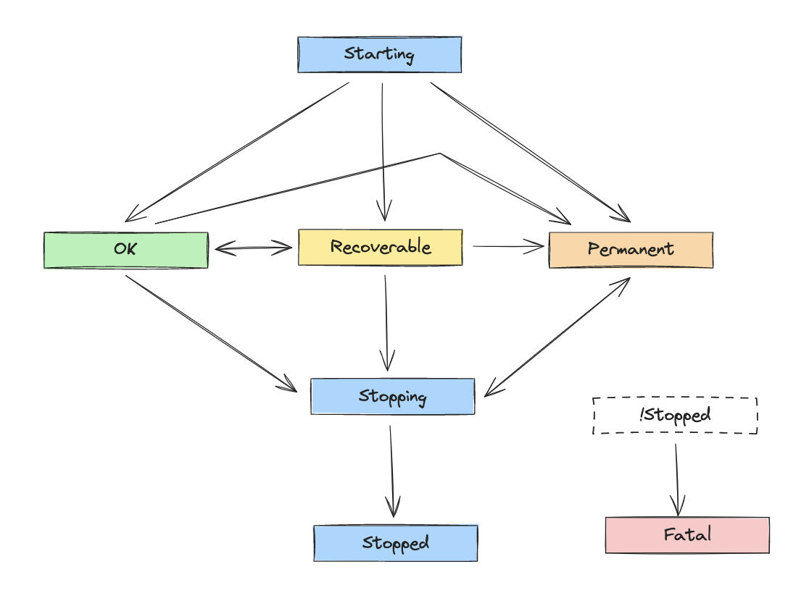
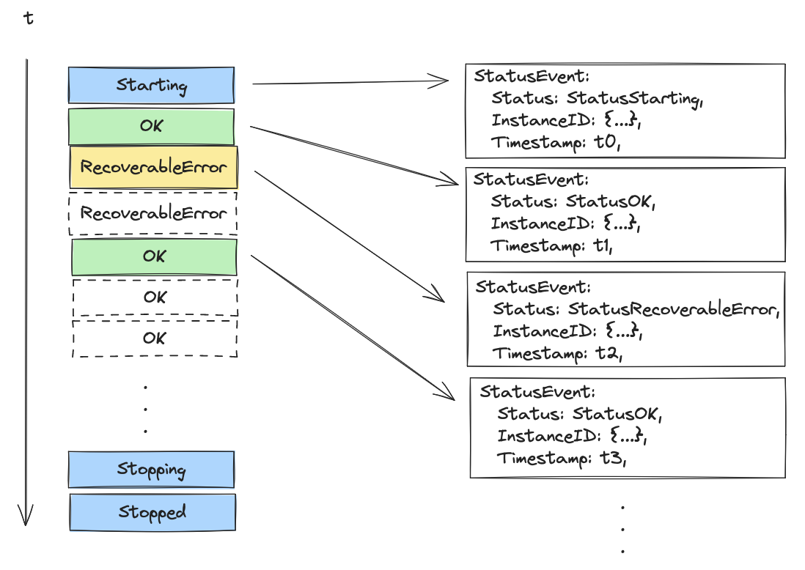
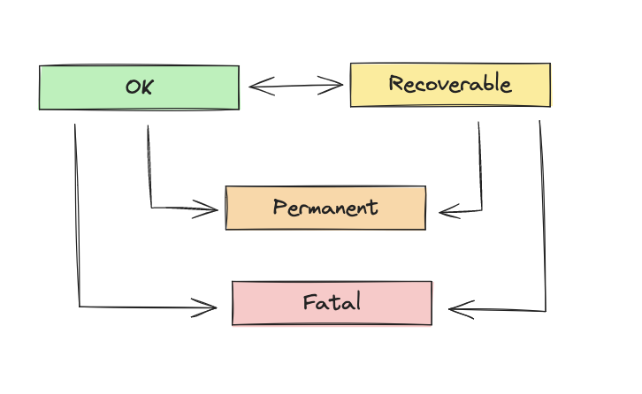

# Component Status Reporting

Component status reporting is a collector feature that allows components to report their status (aka health) via status events to extensions. In order for an extension receive these events it must implement the [StatusWatcher interface](https://github.com/open-telemetry/opentelemetry-collector/blob/f05f556780632d12ef7dbf0656534d771210aa1f/extension/extension.go#L54-L63).

### Status Definitions

The system defines six statuses, listed in the table below:

| Status           | Meaning                                                                                                                                            |
| ---------------- | -------------------------------------------------------------------------------------------------------------------------------------------------- |
| Starting         | The component is starting.                                                                                                                         |
| OK               | The component is running without issue.                                                                                                            |
| RecoverableError | The component has experienced a transient error and may recover.                                                                                   |
| PermanentError   | The component has detected a condition at runtime that will need human intervention to fix. The collector will continue to run in a degraded mode. |
| FatalError       | A component has experienced a fatal error and the collector will shutdown.                                                                        |
| Stopping         | The component is in the process of shutting down.                                                                                                  |
| Stopped          | The component has completed shutdown.                                                                                                              |

Statuses can be categorized into two groups: lifecycle and runtime.

**Lifecycle Statuses**
- Starting
- Stopping
- Stopped

**Runtime Statuses**
- OK
- RecoverableError
- PermanentError
- FatalError

### Transitioning Between Statuses

There is a finite state machine underlying the status reporting API that governs the allowable state transitions. See the state diagram below:

The finite state machine ensures that components progress through the lifecycle properly and it manages transitions through runtime states so that components do not need to track their state internally. Only changes in status result in new events being generated; repeat reports of the same status are ignored. PermanentError is a permanent runtime state. A component in a PermanentError state cannot transition to OK or RecoverableError, but it can transition to Stopping. FatalError is a final state. A component in a FatalError state cannot make any further state transitions.

### Automation

The collector's service implementation is responsible for starting and stopping components. Since it knows when these events occur and their outcomes, it can automate status reporting of lifecycle events for components.

**Start**

The collector will report a Starting event when starting a component. If an error is returned from Start, the collector will report a PermanentError event. If start returns without an error and the component hasn't reported status itself, the collector will report an OK event.

**Shutdown**

The collector will report a Stopping event when shutting down a component. If Shutdown returns an error, the collector will report a PermanentError event. If Shutdown completes without an error, the collector will report a Stopped event.

### Best Practices

**Start**

Under most circumstances, a component does not need to report explicit status during component.Start. An exception to this rule is components that start async work (e.g. spawn a go routine). This is because async work may or may not complete before start returns and timing can vary between executions. A component can halt startup by returning an error from start. If start returns an error, automated status reporting will report a PermanentError on behalf of the component. If start returns without an error automated status reporting will report OK, so long has the component hasn't already reported for itself.

**Runtime**

During runtime a component should not have to keep track of its state. A component should report status as operations succeed or fail and the finite state machine will handle the rest. Changes in status will result in new status events being emitted. Repeat reports of the same status will no-op. Similarly, attempts to make an invalid state transition, such as PermanentError to OK, will have no effect.

We intend to define guidelines to help component authors distinguish between recoverable and permanent errors on a per-component type basis and we'll update this document as we make decisions. See [this issue](https://github.com/open-telemetry/opentelemetry-collector/issues/9957) for current thoughts and discussions.

**Shutdown**

A component should never have to report explicit status during shutdown. Automated status reporting should handle all cases. To recap, the collector will report Stopping before Shutdown is called. If a component returns an error from shutdown the collector will report a PermanentError and it will report Stopped if Shutdown returns without an error.

### Implementation Details

There are a couple of implementation details that are worth discussing for those who work on or wish to understand the collector internals.

**component.TelemetrySettings**

The API for components to report status is the ReportStatus method on the component.TelemetrySettings instance that is part of the CreateSettings passed to a component's factory during creation. It takes a single argument, a status event. The StatusWatcher interface takes both a component instance ID and a status event. The ReportStatus function is customized for each component and passes along the instance ID with each event. A component doesn't know its instance ID, but its ReportStatus method does.

**servicetelemetry.TelemetrySettings**

The service gets a slightly different TelemetrySettings object, a servicetelemetry.TelemetrySettings, which references the ReportStatus method on a status.Reporter. Unlike the ReportStatus method on component.TelemetrySettings, this version takes two arguments, a component instance ID and a status event. The service uses this function to report status on behalf of the components it manages. This is what the collector uses for the automated status reporting of lifecycle events.

**sharedcomponent**

The collector has the concept of a shared component. A shared component is represented as a single component to the collector, but represents multiple logical components elsewhere. The most common usage of this is the OTLP receiver, where a single shared component represents a logical instance for each signal: traces, metrics, and logs (although this can vary based on configuration). When a shared component reports status it must report an event for each of the logical instances it represents. In the current implementation, shared component reports status for all its logical instances during [Start](https://github.com/open-telemetry/opentelemetry-collector/blob/31ac3336d956d93abede6db76453730613e1f076/internal/sharedcomponent/sharedcomponent.go#L89-L98) and [Shutdown](https://github.com/open-telemetry/opentelemetry-collector/blob/31ac3336d956d93abede6db76453730613e1f076/internal/sharedcomponent/sharedcomponent.go#L105-L117). It also [modifies the ReportStatus method](https://github.com/open-telemetry/opentelemetry-collector/blob/31ac3336d956d93abede6db76453730613e1f076/internal/sharedcomponent/sharedcomponent.go#L34-L44) on component.TelemetrySettings to report status for each logical instance when called.
