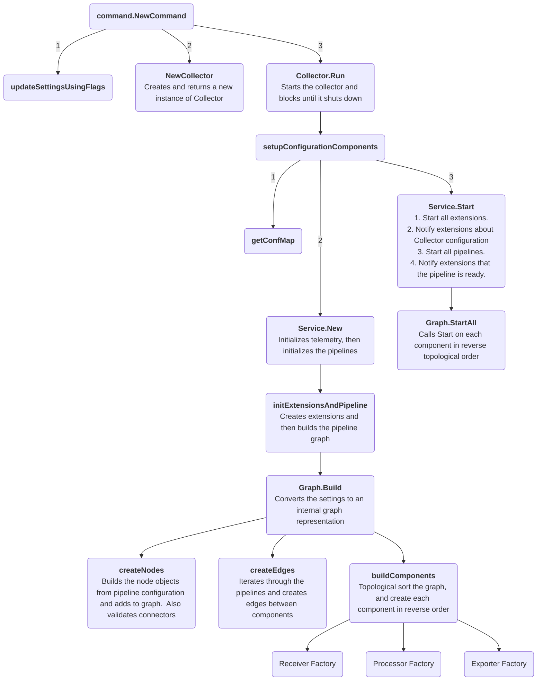

## Collector internal architecture
There are a few resources available to understand how the collector works:
### [Startup Diagram](#startup-diagram)
### [Architecture Docs](https://opentelemetry.io/docs/collector/architecture/)
### [Important Files](#important-files)
### Startup Diagram

### Important Files
Here is a brief list of useful and/or important files that you may find valuable to glance through.
#### [collector.go](../otelcol/collector.go)
This file contains the main Collector struct and its constructor `NewCollector`.

`Collector.Run` starts the collector blocks until it shuts down.

`setupConfigurationComponents` is the "main" function responsible for startup - it orchestrates the loading of the 
configuration, the creation of the graph, and the starting of all the components.

#### [graph.go](../service/internal/graph/graph.go)
This file contains the internal graph representation of the pipelines.

`Build` is the constructor for a Graph object.  The method calls out to helpers that transform the graph from a config
to a DAG of components.  The configuration undergoes additional validation here as well, and is used to instantiate
the components of the pipeline.

`Graph.StartAll` starts every component in the pipelines.

`Graph.ShutdownAll` stops each component in the pipelines

#### [component.go](../component/component.go)
component.go outlines the abstraction of components within OTEL collector.  It provides details on the component 
lifecycle as well as defining the interface that components must fulfil.

#### Factories
Each component type contains a Factory interface along with its corresponding NewFactory function.
Implementations of new components use this NewFactory function in their implementation to register key functions with 
the collector.  For example, the collector uses this interface to give receivers a handle to a nextConsumer - 
representing where the receiver can send data to that it has received.
