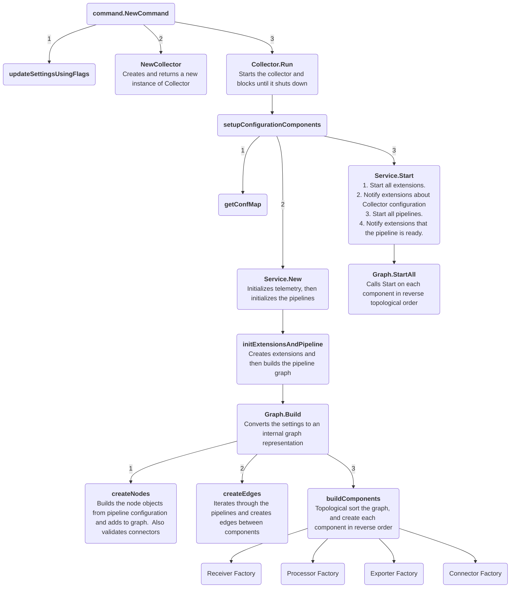
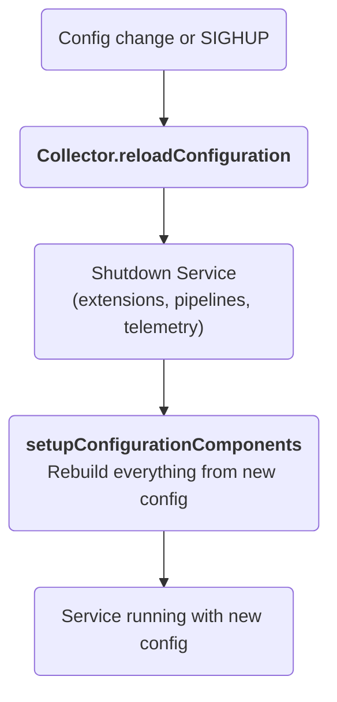
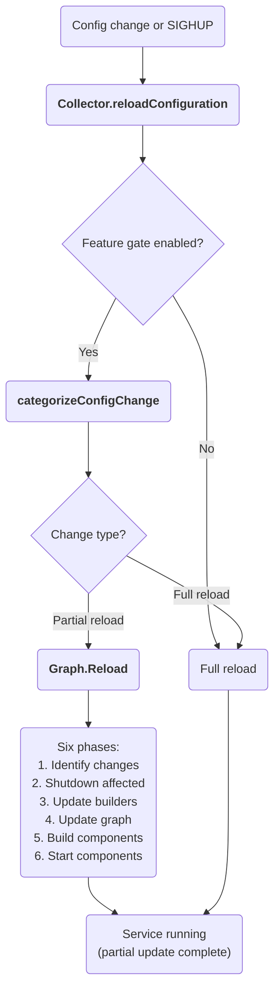

## Internal architecture

This document describes the Collector internal architecture and startup flow. It can be helpful if you are starting to contribute to the Collector codebase.

For the end-user focused architecture document, please see the [opentelemetry.io's Architecture documentation](https://opentelemetry.io/docs/collector/architecture/).  While it is end user focused, it's still a good place to start if you're trying to learn about the Collector codebase.

### Startup Diagram

### Configuration Reload

The Collector supports reloading its configuration at runtime, triggered by a file system change event from a config provider or a `SIGHUP` signal. The reload is handled by `Collector.reloadConfiguration`, which by default performs a **full reload**: the entire `Service` (extensions, pipelines, telemetry) is shut down and rebuilt from scratch using the new configuration. This is simple and correct, but it disrupts all components — processors lose in-flight data, exporter queues are drained, and extensions are restarted — even when only a small part of the config changed.



#### Partial Reload (Alpha)

When the `service.partialReload` feature gate is enabled (`--feature-gates=service.partialReload`), the Collector analyzes what changed in the configuration and performs the minimum necessary reload:

| Change Type | Requires Full Reload? | What Gets Rebuilt |
|-------------|----------------------|-------------------|
| Receiver config | No | Changed receivers + upstream chain rebuilt |
| Receiver pipeline membership | No | Affected receivers rebuilt |
| Processor config | No | Processors + receivers in affected pipelines |
| Exporter config | No | Exporters + processors + receivers in affected pipelines |
| Connector config | No | Connectors + processors + receivers in affected pipelines |
| Add pipeline | No | New pipeline components + shared receivers rebuilt |
| Remove pipeline | No | Removed pipeline components shut down, shared components rebuilt |
| Add/remove exporters in pipeline | No | FanOut rebuilt + processors + receivers in pipeline |
| Add connector between pipelines | No | Connector created + affected pipelines rebuilt |
| Remove connector from pipelines | No | Connector removed + affected pipelines rebuilt |
| Extension config | Yes | Everything |
| Extension list | Yes | Everything |
| Telemetry config | Yes | Everything |

##### Pipeline Structure and Consumer References

The pipeline graph has this structure:

```
receiver -> capabilitiesNode -> processor(s) -> fanOutNode -> exporter(s)
                                                          \-> connector(s)
```

**Node Identity**: Receiver and exporter nodes are identified by `(signal type, component ID)`. This means:
- Pipelines with the **same signal type** (e.g., two `traces` pipelines) using the same receiver ID share one receiver node
- Pipelines with **different signal types** (e.g., `traces` and `metrics`) using the same receiver ID have separate receiver nodes

Each component stores a reference to its **next consumer** when it is built. This means that when a downstream component is recreated, all upstream components must also be recreated to get fresh consumer references:

- **Exporter changes**: The exporter is rebuilt in-place (same node, new component). The fanOutNode is rebuilt to reference the new exporter. Processors must be recreated to get the new fanOutNode reference. The capabilitiesNode is rebuilt, and receivers must be recreated to get the new capabilitiesNode reference.
- **Processor changes**: Processors are recreated. The capabilitiesNode is rebuilt, and receivers must be recreated.
- **Receiver changes**: Changed receivers are recreated. Receivers are also rebuilt when their pipeline membership changes (e.g., a pipeline using them is added or removed).

##### The Six Phases of Partial Reload

The `Graph.Reload` method performs partial reload in six phases:

1. **Identify Changes**: Analyze old vs new configs using helper functions:
   - `identifyPipelineChanges`: Find added/removed pipelines
   - `identifyProcessorChanges`: Find pipelines affected by processor config changes
   - `identifyReceiverChanges`: Categorize receivers into add/remove/rebuild based on config and pipeline membership changes
   - `identifyExporterConnectorChanges`: Find exporters/connectors to rebuild (config changes) or add/remove (list changes)
   - `markReceiversInAffectedPipelines`: Mark receivers for rebuild in pipelines affected by downstream changes

2. **Shutdown**: Stop components in upstream-to-downstream order:
   - Shutdown receivers being removed or rebuilt (stops data flow first)
   - Shutdown processors in affected pipelines and pipelines being removed
   - Shutdown exporters being rebuilt or in pipelines being removed
   - Shutdown connectors being rebuilt or removed

3. **Update Builders**: Create new builders for components that will be rebuilt:
   - Update ExporterBuilder if exporters changed or pipelines added
   - Update ConnectorBuilder if connectors changed
   - Update ProcessorBuilder if pipelines are affected or added
   - Update ReceiverBuilder if receivers changed or pipelines added

4. **Update Graph**: Modify the graph structure:
   - Remove all nodes from pipelines being removed (with instanceID updates for shared components)
   - Remove receiver nodes being removed or rebuilt
   - Remove processor nodes in affected pipelines
   - Remove connector nodes being removed
   - Create new exporter nodes for pipelines with changed exporter lists
   - Create new connector nodes
   - Create new pipelines (with all their nodes)
   - Create new processor nodes for affected pipelines
   - Create new receiver nodes
   - Wire edges between nodes

5. **Build**: Create new component instances in downstream-to-upstream order:
   - Build exporters (both rebuilt and newly added)
   - Build connectors (both rebuilt and newly added)
   - Rebuild fanOutNode for pipelines with changed exporters/connectors
   - Build processors in reverse order (last processor first)
   - Rebuild capabilitiesNode for affected pipelines
   - Build receivers

6. **Start**: Start components in downstream-to-upstream order:
   - Start rebuilt exporters, then newly added exporters
   - Start connectors
   - Start processors (reverse order within each pipeline)
   - Start receivers (last, to begin data flow)

##### Examples

**Example 1: Receiver Config Change**

Configuration change: Modify the `otlp` receiver's endpoint.

```
Before: receivers.otlp.protocols.grpc.endpoint = "0.0.0.0:4317"
After:  receivers.otlp.protocols.grpc.endpoint = "0.0.0.0:4318"
```

What happens:
- Only the `otlp` receiver is shut down, rebuilt, and started
- Processors, exporters, and other receivers continue running uninterrupted

**Example 2: Processor Config Change**

Configuration change: Modify the `batch` processor's timeout in the `traces` pipeline.

```
Before: processors.batch.timeout = "200ms"
After:  processors.batch.timeout = "500ms"
```

What happens:
1. All receivers in the `traces` pipeline are shut down
2. The `batch` processor is shut down
3. New processor node is created with new config
4. capabilitiesNode is rebuilt
5. Processor is built and started
6. Receivers are rebuilt and started
7. Exporters continue running—queue state preserved

**Example 3: Exporter Config Change**

Configuration change: Modify the `otlp` exporter's endpoint.

```
Before: exporters.otlp.endpoint = "backend:4317"
After:  exporters.otlp.endpoint = "new-backend:4317"
```

What happens:
1. All receivers in pipelines using this exporter are shut down
2. All processors in those pipelines are shut down
3. The exporter is shut down
4. Exporter is rebuilt (new component on same node)
5. fanOutNode is rebuilt to reference new exporter
6. Processors are rebuilt and started
7. capabilitiesNode is rebuilt
8. Receivers are rebuilt and started

**Example 4: Multi-Pipeline with Isolated Change**

Configuration: Two pipelines of the same signal type share an exporter but have different processors.

```yaml
pipelines:
  traces/frontend:
    receivers: [otlp/frontend]
    processors: [batch/frontend]
    exporters: [otlp]
  traces/backend:
    receivers: [otlp/backend]
    processors: [batch/backend]
    exporters: [otlp]
```

Configuration change: Modify `batch/frontend` processor config.

What happens:
- `traces/frontend` pipeline: receiver and processor are rebuilt
- `traces/backend` pipeline: **completely unaffected**—continues running
- `otlp` exporter: continues running (shared, but no config change)

**Example 5: Pipeline Removal with Shared Receiver**

Configuration: Two pipelines of the same signal type share a receiver.

```yaml
pipelines:
  traces/first:
    receivers: [otlp]
    processors: [batch/first]
    exporters: [otlp/first]
  traces/second:
    receivers: [otlp]       # Same receiver as traces/first
    processors: [batch/second]
    exporters: [otlp/second]
```

Configuration change: Remove the `traces/second` pipeline.

What happens:
1. `traces/second` pipeline components are shut down and removed
2. The shared `otlp` receiver is rebuilt because its pipeline membership changed (was in both pipelines, now only in `traces/first`)
3. `traces/first` pipeline's processor and capabilitiesNode are rebuilt to maintain consumer references
4. The `otlp/first` exporter continues running uninterrupted

**Example 6: Exporter List Change**

Configuration change: Remove an exporter from a pipeline's exporter list.

```yaml
# Before
pipelines:
  traces:
    receivers: [otlp]
    processors: [batch]
    exporters: [otlp/primary, otlp/secondary]

# After
pipelines:
  traces:
    receivers: [otlp]
    processors: [batch]
    exporters: [otlp/primary]  # otlp/secondary removed
```

What happens:
1. The `otlp/secondary` exporter is shut down
2. The fanOutNode is rebuilt with only `otlp/primary`
3. All processors are rebuilt to get the new fanOutNode reference
4. The capabilitiesNode is rebuilt
5. The receiver is rebuilt to get the new capabilitiesNode reference
6. The `otlp/primary` exporter continues running uninterrupted



### Where to start to read the code
Here is a brief list of useful and/or important files and interfaces that you may find valuable to glance through.
Most of these have package-level documentation and function/struct-level comments that help explain the Collector!

- [collector.go](../otelcol/collector.go)
- [graph.go](../service/internal/graph/graph.go)
- [component.go](../component/component.go)

#### Factories
Each component type contains a `Factory` interface along with its corresponding `NewFactory` function.
Implementations of new components use this `NewFactory` function in their implementation to register key functions with 
the Collector.  An example of this is in [receiver.go](../receiver/receiver.go).

For example, the Collector uses this interface to give receivers a handle to a `nextConsumer` -
which represents where the receiver will send its data next in its telemetry pipeline.
