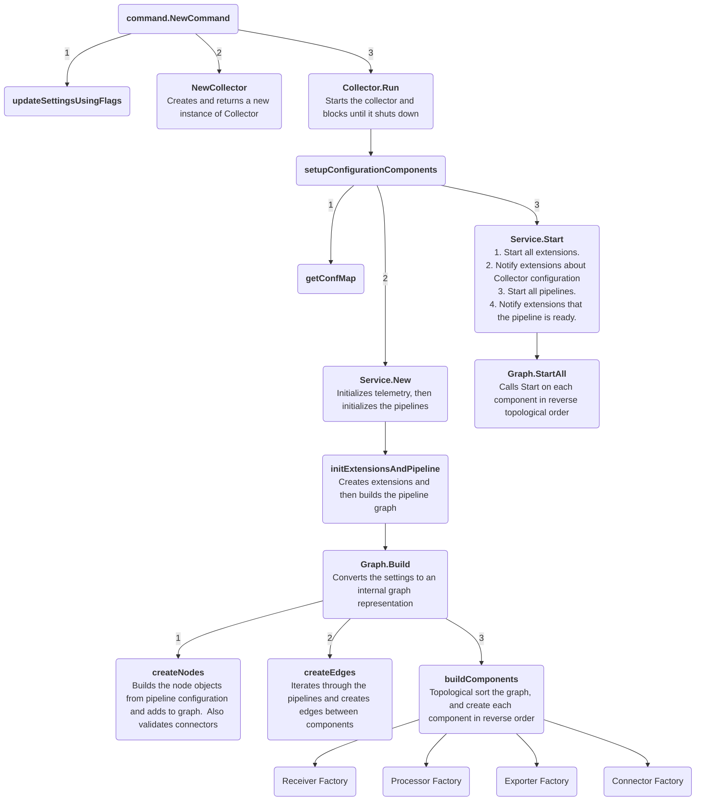

## Internal architecture

This document describes the Collector internal architecture and startup flow. It can be helpful if you are starting to contribute to the Collector codebase.

For the end-user focused architecture document, please see the [opentelemetry.io's Architecture documentation](https://opentelemetry.io/docs/collector/architecture/).  While it is end user focused, it's still a good place to start if you're trying to learn about the Collector codebase.

### Startup Diagram

### Where to start to read the code
Here is a brief list of useful and/or important files and interfaces that you may find valuable to glance through.
Most of these have package-level documentation and function/struct-level comments that help explain the Collector!

- [collector.go](../otelcol/collector.go)
- [graph.go](../service/internal/graph/graph.go)
- [component.go](../component/component.go)

#### Factories
Each component type contains a `Factory` interface along with its corresponding `NewFactory` function.
Implementations of new components use this `NewFactory` function in their implementation to register key functions with 
the Collector.  An example of this is in [receiver.go](../receiver/receiver.go).

For example, the Collector uses this interface to give receivers a handle to a `nextConsumer` -
which represents where the receiver will send its data next in its telemetry pipeline.
