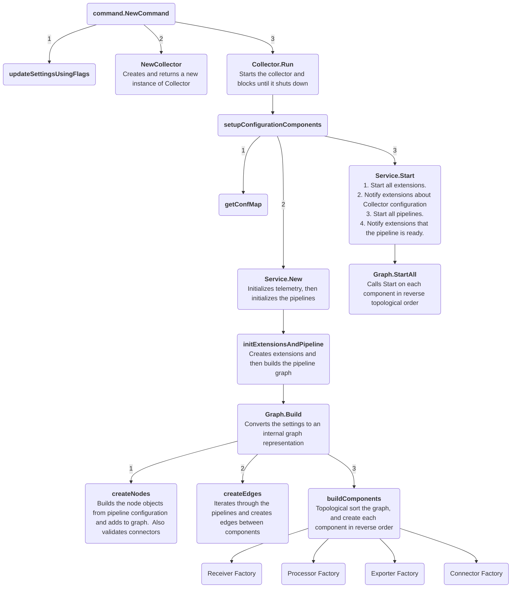
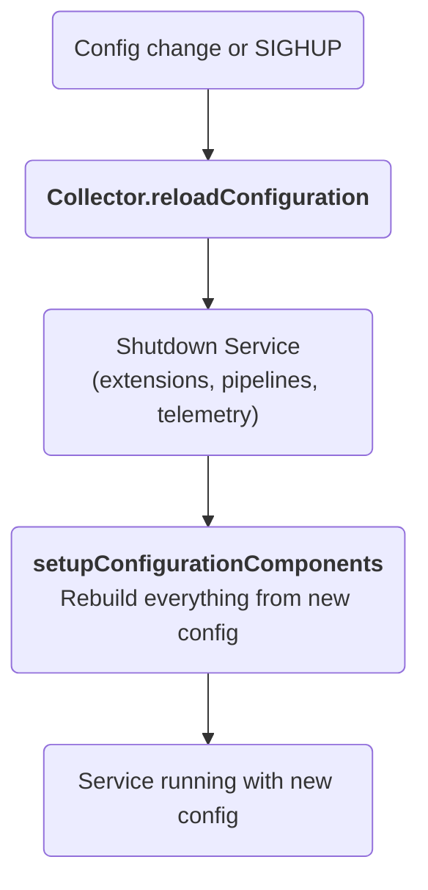
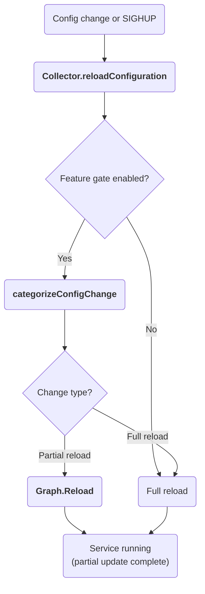

## Internal architecture

This document describes the Collector internal architecture and startup flow. It can be helpful if you are starting to contribute to the Collector codebase.

For the end-user focused architecture document, please see the [opentelemetry.io's Architecture documentation](https://opentelemetry.io/docs/collector/architecture/).  While it is end user focused, it's still a good place to start if you're trying to learn about the Collector codebase.

### Startup Diagram

### Configuration Reload

The Collector supports reloading its configuration at runtime, triggered by a file system change event from a config provider or a `SIGHUP` signal. The reload is handled by `Collector.reloadConfiguration`, which by default performs a **full reload**: the entire `Service` (extensions, pipelines, telemetry) is shut down and rebuilt from scratch using the new configuration. This is simple and correct, but it disrupts all components — processors lose in-flight data, exporter queues are drained, and extensions are restarted — even when only a small part of the config changed.

#### Partial Reload (Alpha)

When the `service.partialReload` feature gate is enabled (`--feature-gates=service.partialReload`), the Collector analyzes what changed in the configuration and performs the minimum necessary reload:

| Change Type | Components Restarted | Components Unchanged |
|-------------|---------------------|----------------------|
| Receivers only | Changed receivers only | Processors, Exporters, Connectors, Extensions, unchanged receivers |
| Processors (±receivers) | Changed processors, changed receivers | Exporters, Connectors, Extensions, unchanged receivers in unaffected pipelines |
| Exporters, Connectors, Extensions, Pipeline structure, Telemetry | Full reload | — |

The partial reload path (`Collector.tryPartialReload`) categorizes the config change using `categorizeConfigChange`, then delegates to **`Graph.Reload`** for both receiver-only and processor changes. This method performs differential updates:

**For receiver-only changes:**
  1. **Identify** receivers that need to be added, removed, or rebuilt (config or pipeline membership changed)
  2. **Shutdown** only receivers being removed or rebuilt
  3. **Remove** old receiver nodes from the graph
  4. **Create** new receiver nodes for added/rebuilt receivers
  5. **Wire** edges to existing capabilities nodes
  6. **Build** and **Start** new receivers

**For processor changes (affects entire pipelines):**
  1. **Identify** pipelines where processors changed (added, removed, config modified, order changed)
  2. **Identify** receivers that changed independently
  3. **Shutdown** changed receivers and all processors in affected pipelines
  4. **Remove** old nodes from the graph
  5. **Create** new processor and receiver nodes
  6. **Wire** edges (receivers→capabilities→processors→fanout)
  7. **Build** processors in reverse order, then rebuild capabilitiesNode
  8. **Build** changed receivers
  9. **Start** processors (reverse order), then start receivers

Exporters, connectors, and extensions remain running and untouched, preserving in-flight data and exporter queue state. Unchanged receivers continue operating without interruption. If the config change affects exporters, connectors, extensions, telemetry, or pipeline structure, the partial reload is skipped and the standard full reload executes.

### Where to start to read the code
Here is a brief list of useful and/or important files and interfaces that you may find valuable to glance through.
Most of these have package-level documentation and function/struct-level comments that help explain the Collector!

- [collector.go](../otelcol/collector.go)
- [graph.go](../service/internal/graph/graph.go)
- [component.go](../component/component.go)

#### Factories
Each component type contains a `Factory` interface along with its corresponding `NewFactory` function.
Implementations of new components use this `NewFactory` function in their implementation to register key functions with 
the Collector.  An example of this is in [receiver.go](../receiver/receiver.go).

For example, the Collector uses this interface to give receivers a handle to a `nextConsumer` -
which represents where the receiver will send its data next in its telemetry pipeline.
