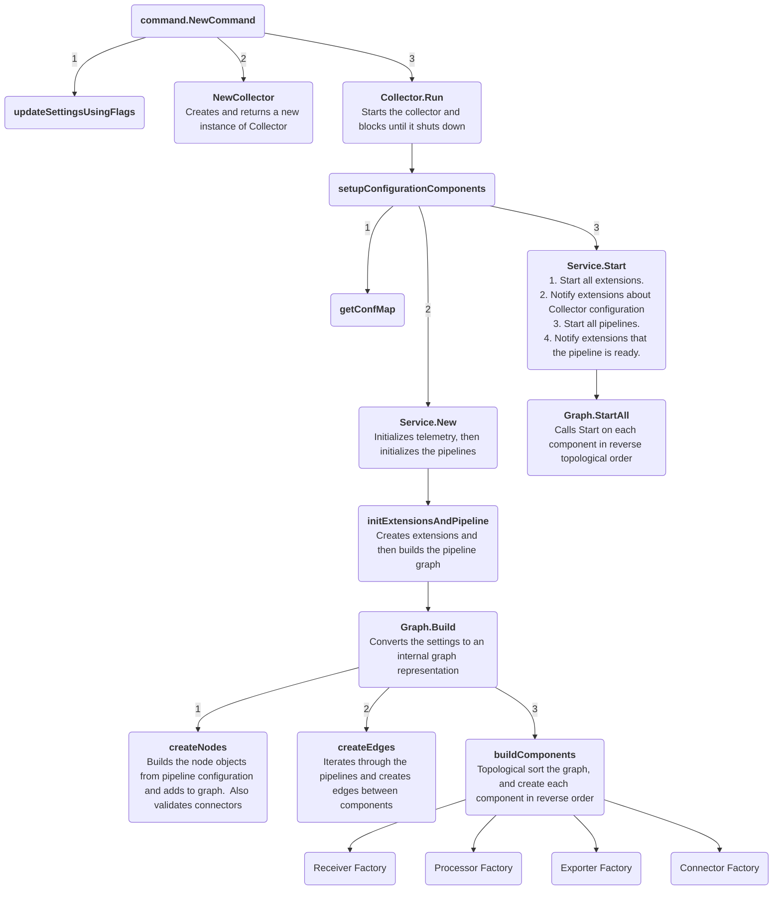
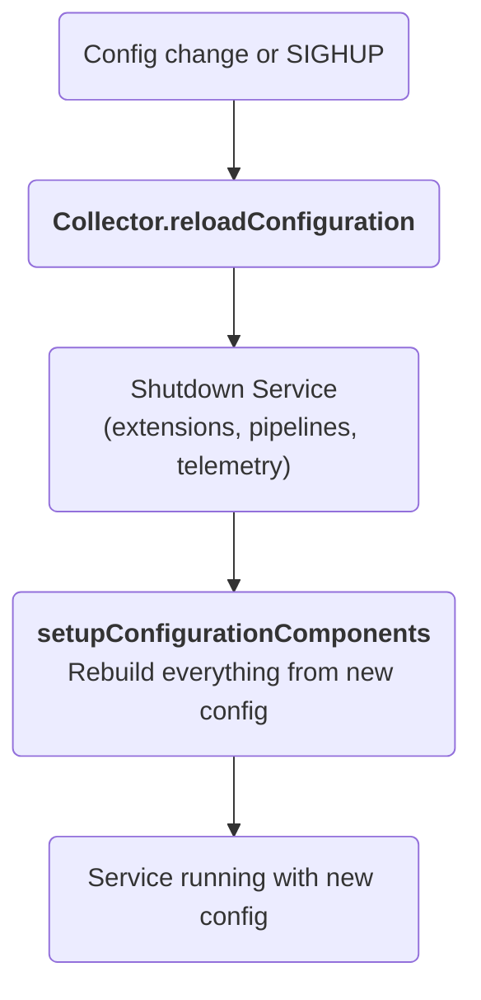
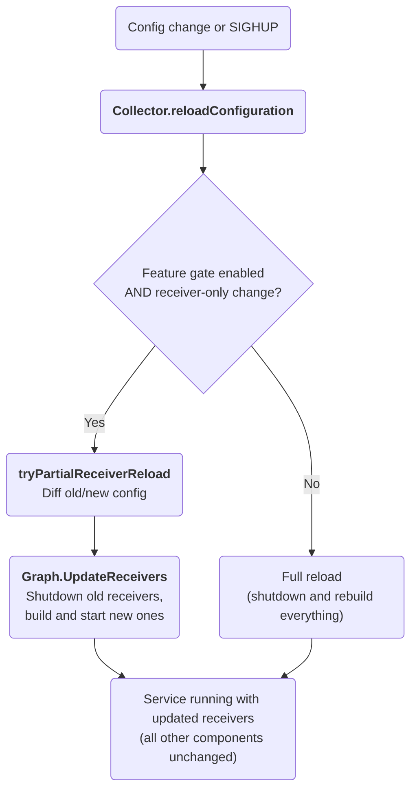

## Internal architecture

This document describes the Collector internal architecture and startup flow. It can be helpful if you are starting to contribute to the Collector codebase.

For the end-user focused architecture document, please see the [opentelemetry.io's Architecture documentation](https://opentelemetry.io/docs/collector/architecture/).  While it is end user focused, it's still a good place to start if you're trying to learn about the Collector codebase.

### Startup Diagram

### Configuration Reload

The Collector supports reloading its configuration at runtime, triggered by a file system change event from a config provider or a `SIGHUP` signal. The reload is handled by `Collector.reloadConfiguration`, which by default performs a **full reload**: the entire `Service` (extensions, pipelines, telemetry) is shut down and rebuilt from scratch using the new configuration. This is simple and correct, but it disrupts all components — processors lose in-flight data, exporter queues are drained, and extensions are restarted — even when only a small part of the config changed.

#### Partial Receiver Reload (Alpha)

When the `service.receiverPartialReload` feature gate is enabled (`--feature-gates=service.receiverPartialReload`), the Collector first checks whether the config change is limited to receivers. If only receiver configurations and/or pure-receiver entries in pipeline receiver lists have changed — and all other sections (processors, exporters, connectors, extensions, telemetry, pipeline structure) are identical — a partial reload is performed instead.

The partial reload path (`Collector.tryPartialReceiverReload`) delegates to `Graph.UpdateReceivers`, which runs a 9-phase algorithm:

1. **Collect** all current receiver nodes from pipelines (skipping connectors-as-receivers)
2. **Determine** the desired receiver set from the new pipeline configs
3. **Categorize** receivers into add, remove, and rebuild sets
4. **Shutdown** receivers that are being removed or rebuilt
5. **Remove** old receiver nodes and edges from the graph
6. **Create** new receiver nodes for added and rebuilt receivers
7. **Wire** edges from new receiver nodes to existing downstream capabilities nodes
8. **Build** new receiver components via their factories
9. **Start** new receivers

Processors, exporters, connectors, and extensions remain running and untouched throughout. If the config change affects anything beyond receivers, the partial reload is skipped and the standard full reload executes.

### Where to start to read the code
Here is a brief list of useful and/or important files and interfaces that you may find valuable to glance through.
Most of these have package-level documentation and function/struct-level comments that help explain the Collector!

- [collector.go](../otelcol/collector.go)
- [graph.go](../service/internal/graph/graph.go)
- [component.go](../component/component.go)

#### Factories
Each component type contains a `Factory` interface along with its corresponding `NewFactory` function.
Implementations of new components use this `NewFactory` function in their implementation to register key functions with 
the Collector.  An example of this is in [receiver.go](../receiver/receiver.go).

For example, the Collector uses this interface to give receivers a handle to a `nextConsumer` -
which represents where the receiver will send its data next in its telemetry pipeline.
