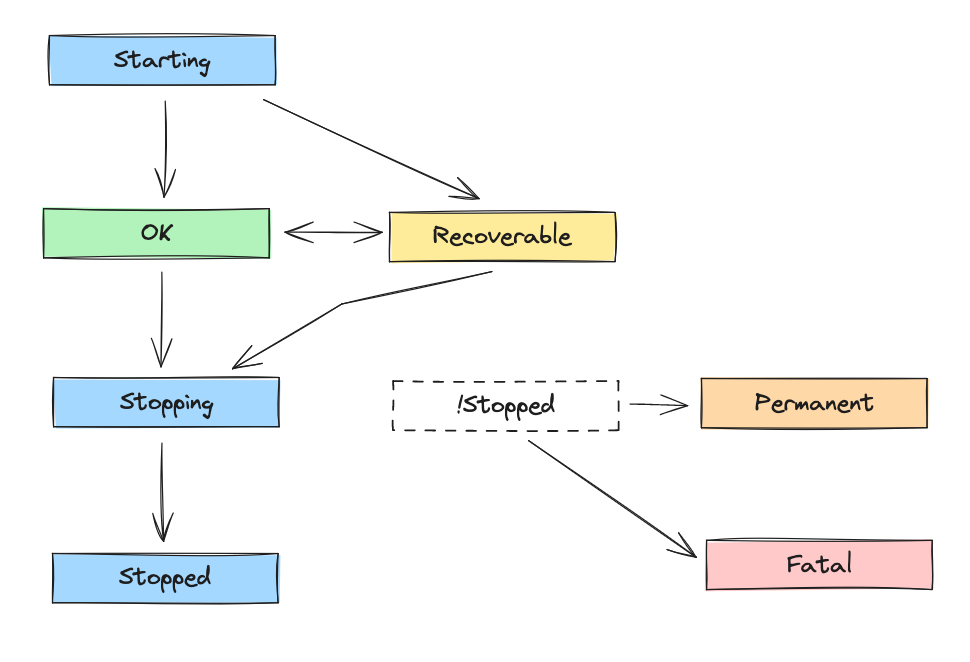
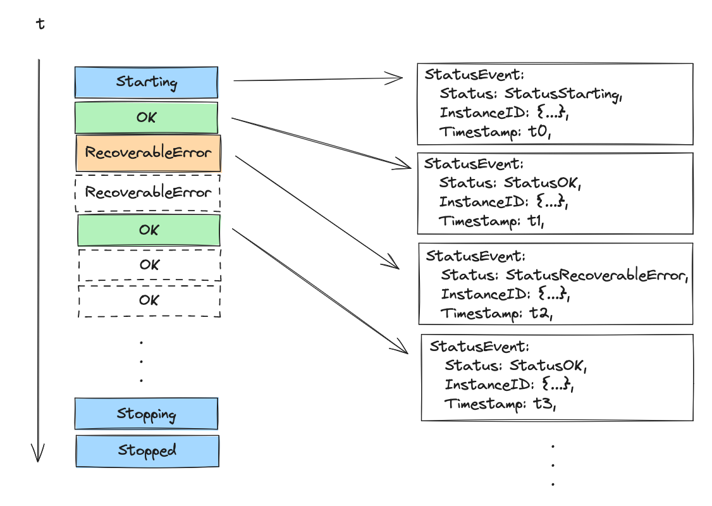
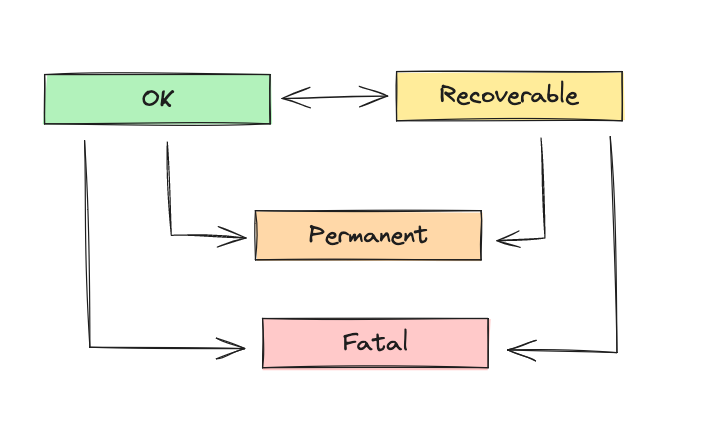

# Component Status Reporting

## Overview

Since the OpenTelemetry Collector is made up of pipelines with components, it needs a way for the components within those pipelines to emit information about their health. This information allows the collector service, or other interested software or people, to make decisions about how to proceed when something goes wrong. This document describes:

1. The historical state of how components reported health
2. The current state of how components report health
3. The goals component health reporting should achieve
4. Existing deviations from those goals
5. Desired behavior for 1.0

For the sake of simplicity, when `Host` is referenced in this document you can think of the Collector service, which manages all the collector pipelines and the components within.

## Out Of Scope

How to get from the current to desired behavior is also considered out of scope and will be discussed on individual PRs. It will likely involve one or multiple feature gates, warnings and transition periods.

## The Collector’s Historical method of reporting component health
Until recently, the Collector relied on four ways to report health.

1. The `error` returned by the Component’s Start method. During startup, if any component decided to return an error, the Collector would stop gracefully.
2. The `Host.ReportFatalError` method.  This method let components tell the Host that something bad happened and the collector needed to shut down.  While this method could be used anywhere in the component, it was primarily used with a Component’s Start method to report errors in async work, such as starting a server.
    ```golang
    if errHTTP := fmr.server.Serve(listener); errHTTP != nil && !errors.Is(errHTTP, http.ErrServerClosed) {
       host.ReportFatalError(errHTTP)
    }
    ```
3. The error returned by `Shutdown`. This error was indicative that the collector did not cleanly shut down, but did not prevent the shutdown process from moving forward.

4. Panicking. During runtime, if the collector experienced an unhandled error, it crashes.

These are all the way the components in a collector could report that they were unhealthy.

There are several major gaps in the Collector’s historic reporting of component health. First, many components return recoverable errors from Start, causing the collector to shutdown, while it could recover if the collector was allowed to run. Second, when a component experienced a transient error, such as an endpoint suddenly not working, the component would simply log the error and return it up the pipeline. There was no mechanism for the component to tell the Host or anything else that something was going wrong. Last, when a component experienced an issue it would never be able to recover from, such as receiving a 404 response from an endpoint, the component would log the error and return it up the pipeline.  This situation was handled in the same way as the transient error, which means the component could not tell the Host or anything else that something was wrong, but worse is that the issue would never get better.

## Current State of Component Health Reporting

In Collector version v0.87.0 a new feature, component status reporting, was released. This feature created a standard mechanism for Components to report their health to extensions.

Component status reporting is a collector feature that allows components to report their status (aka health) via status events to extensions. In order for an extension to receive these events it must implement the [StatusWatcher interface](https://github.com/open-telemetry/opentelemetry-collector/blob/f05f556780632d12ef7dbf0656534d771210aa1f/extension/extension.go#L54-L63). The collector provides the communication between components and extensions, but does not use or interpret the events itself.

### Status Definitions

The system defines seven statuses, listed in the table below:

|    **Status**    |                                                                    **Meaning**                                                                     |
|:----------------:|:--------------------------------------------------------------------------------------------------------------------------------------------------:|
|     Starting     |                                                             The component is starting.                                                             |
|        OK        |                                                      The component is running without issue.                                                       |
| RecoverableError |                                          The component has experienced a transient error and may recover.                                          |
|  PermanentError  | The component has detected a condition at runtime that will need human intervention to fix. The collector will continue to run in a degraded mode. |
|    FatalError    |          The collector has experienced a fatal error and will shutdown. This is intended to be used as a way to fail-fast during startup.          |
|     Stopping     |                                                 The component is in the process of shutting down.                                                  |
|     Stopped      |                                                       The component has completed shutdown.                                                        |

Statuses can be categorized into two groups: lifecycle and runtime.

**Lifecycle Statuses**
- Starting
- Stopping
- Stopped

**Runtime Statuses**
- OK
- RecoverableError
- FatalError
- PermanentError 

### Transitioning Between Statuses

There is a finite state machine underlying the status reporting API that governs the allowable state transitions. See the state diagram below:



The finite state machine ensures that components progress through the lifecycle properly and it manages transitions through runtime states so that components do not need to track their state internally. Only changes in status result in new events being generated; repeat reports of the same status are ignored. PermanentError and FatalError are permanent runtime states. A component in these states cannot make any further state transitions.



### Automation

The collector’s service implementation is responsible for starting and stopping components. Since it knows when these events occur and their outcomes, it can automate status reporting of lifecycle events for components.

#### Start

The collector will report a Starting event when starting a component. If an error is returned from Start, the collector will report a PermanentError event. If start returns without an error and the collector hasn't reported status itself, the collector will report an OK event.

#### Shutdown

The collector will report a Stopping event when shutting down a component. If Shutdown returns an error, the collector will report a PermanentError event. If Shutdown completes without an error, the collector will report a Stopped event.
Best Practices

#### Start

Under most circumstances, a component does not need to report explicit status during component.Start. An exception to this rule is components that start async work (e.g. spawn a go routine). This is because async work may or may not complete before start returns and timing can vary between executions. A component can halt startup by returning an error from start. If start returns an error, automated status reporting will report a PermanentError on behalf of the component. If a component wishes to halt startup from work spawned in a go routine, it can report a FatalError. If start returns without an error automated status reporting will report OK, as long as the component hasn't already reported for itself.

#### Runtime



During runtime a component should not have to keep track of its state. A component should report status as operations succeed or fail and the finite state machine will handle the rest. Changes in status will result in new status events being emitted. Repeat reports of the same status will no-op. Similarly, attempts to make an invalid state transition, such as PermanentError to OK, will have no effect.

We intend to define guidelines to help component authors distinguish between recoverable and permanent errors on a per-component type basis and we'll update this document as we make decisions. See [this issue](https://github.com/open-telemetry/opentelemetry-collector/issues/9957) for current thoughts and discussions.

#### Shutdown

A component should never have to report explicit status during shutdown. Automated status reporting should handle all cases. To recap, the collector will report Stopping before Shutdown is called. If a component returns an error from shutdown the collector will report a PermanentError and it will report Stopped if Shutdown returns without an error.

### In the Weeds

There are a couple of implementation details that are worth discussing for those who work on or wish to understand the collector internals.

**component.TelemetrySettings**

The API for components to report status is the ReportStatus method on the component.TelemetrySettings instance that is part of the CreateSettings passed to a component's factory during creation. It takes a single argument, a status event. The StatusWatcher interface takes both a component instance ID and a status event. The ReportStatus function is customized for each component and passes along the instance ID with each event. A component doesn't know its instance ID, but its ReportStatus method does.

**servicetelemetry.TelemetrySettings**

The service gets a slightly different TelemetrySettings object, a servicetelemetry.TelemetrySettings, which references the ReportStatus method on a status.Reporter. Unlike the ReportStatus method on component.TelemetrySettings, this version takes two arguments, a component instance ID and a status event. The service uses this function to report status on behalf of the components it manages. This is what the collector uses for the automated status reporting of lifecycle events.

**sharedcomponent**

The collector has the concept of a shared component. A shared component is represented as a single component to the collector, but represents multiple logical components elsewhere. The most common usage of this is the OTLP receiver, where a single shared component represents a logical instance for each signal: traces, metrics, and logs (although this can vary based on configuration). When a shared component reports status it must report an event for each of the logical instances it represents. In the current implementation, shared component reports status for all its logical instances during [Start](https://github.com/open-telemetry/opentelemetry-collector/blob/31ac3336d956d93abede6db76453730613e1f076/internal/sharedcomponent/sharedcomponent.go#L89-L98) and [Shutdown](https://github.com/open-telemetry/opentelemetry-collector/blob/31ac3336d956d93abede6db76453730613e1f076/internal/sharedcomponent/sharedcomponent.go#L105-L117). It also [modifies the ReportStatus method](https://github.com/open-telemetry/opentelemetry-collector/blob/31ac3336d956d93abede6db76453730613e1f076/internal/sharedcomponent/sharedcomponent.go#L34-L44) on component.TelemetrySettings to report status for each logical instance when called.

## The Goals the Component Health Reporting Should Achieve

The following are the goals, as of June 2024 and with Collector 1.0 looming, for a component health reporting system.

1. Runtime component health reporting, which cannot be automatically reported, must be opt-in for components.  Collector components must not be required to use the component health reporting system. This keeps component as compatible as possible with the Collector’s framework as we approach 1.0
    - The consumers of the health reporting system must be able to identify which components are and are not using the health reporting system.
2. Component health reporting must be opt-in for collector users.  While the underlying components are always allowed to report their health via the system, the Collector Host or any other listener may only take action when the user has configured the collector accordingly.
   - As one example of compliance, the current health reporting system is dependent on the user configuring an extension that can watch for status updates.
3. Component health must be representable as a finite state machine with clear transitions between states.
4. The Collector Host may report statuses Starting, Ok,  Stopping and PermanentError on behalf of components as documented in the automation section.
    - Additional status may be reported in the future
5. Component health reporting must only be a mechanism for reporting health - it should have no mechanisms for taking actions on the health it reports.  How consumers of the health reporting system respond to component updates is not a concern of the health reporting system.

## Existing deviations from those goals

### Fatal Error Reporting

Before the current implementation of component status reporting, a component could stop the collector by using `Host.ReportFatalError`. Now, a component MUST use component status reporting and emit a `FatalError`. This fact is in conflict with Goal 1, which states component health reporting must be opt-in for components.

A couple solutions:
1. Accept this reality as an exception to Goal 1.
2. Add back `Host.ReportFatalError`.
3. Remove the ability for components to stop the collector be removing `FatalError`.

### No way to identify components that are not reporting status
Goal 1 states that consumers of component status reporting must be able to identify components in use that have not opted in to component status reporting. Our current implementation does not have this feature.

### Should component health reporting be an opt-in for `component.Host` implementations?

The current implementation of component status reporting does not add anything to `component.Host` to force a `component.Host` implementation, such as `service.Service`, to be compatible with component status reporting.  Instead, it adds `ReportStatus func(*StatusEvent)` to `component.TelemetrySettings` and things that instantiate components, such as `serivce.Service`, should, but are not required, to pass in a value for `ReportStatus`.

As a result, `component.Host` implementation is not required to engage with the component status reporting system.  This could lead to situations where a user adds a status watcher extension that can do nothing because the `component.Host` is not reporting component status updates.

Is this acceptable? Should we:
1. Require the `component.Host` implementations be compatible with the component status reporting framework?
2. Add some sort of configuration/build flag then enforces the `component.Host` implementation be compatible (or not) with component status reporting?
3. Accept this edge case.

### Component TelemetrySettings Requirements

The current implementation of component status reporting added a new field to `component.TelemetrySettings`, `ReportStatus`.  This field is technically optional, but would be marked as stable with component 1.0. Are we ok with 1 of the following?

1. Including a component status reporting feature, `component.TelemetrySettings.ReportStatus`, in the 1.0 version of `component.TelemetrySettings`?
2. Marking `component.TelemetrySettings.ReportStatus` as experimentatal via godoc comments in the 1.0 version of `component.TelemetrySettings`?

Or should we refactor `component` somehow to remove `ReportStatus` from `component.TelemetrySettings`?

## Desired Behavior for 1.0

All deviations for the goals should be addressed so that component 1.0 can be released with a non-GA implementation of component status reporting.

## Reference
- Remove FatalError? Looking for opinions either way: https://github.com/open-telemetry/opentelemetry-collector/issues/9823
- In order to prioritize lifecycle events over runtime events for status reporting, allow a component to transition from PermanentError -> Stopping: https://github.com/open-telemetry/opentelemetry-collector/issues/10058
- Runtime status reporting for components in core: https://github.com/open-telemetry/opentelemetry-collector/issues/9957
- Should Start return an error: https://github.com/open-telemetry/opentelemetry-collector/issues/9324
- Should Shutdown return an error: https://github.com/open-telemetry/opentelemetry-collector/issues/9325
- Status reporting doc incoming; preview here: https://github.com/mwear/opentelemetry-collector/blob/cc870fd2a7160da298acdda447511ea9a83455e0/docs/component-status.md
- Issues
  - Closed: https://github.com/open-telemetry/opentelemetry-collector-contrib/issues/8349
  - Open: https://github.com/open-telemetry/opentelemetry-collector-contrib/issues/8816
- Status Reporting PRs
  - Closed
    - https://github.com/open-telemetry/opentelemetry-collector/pull/5304
    - https://github.com/open-telemetry/opentelemetry-collector/pull/6550
    - https://github.com/open-telemetry/opentelemetry-collector/pull/6560
  - Merged
    - https://github.com/open-telemetry/opentelemetry-collector/pull/8169


