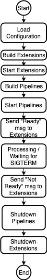

# OpenTelemetry Service: Extension Components

Besides the pipeline elements (receivers, processors, and exporters) the OTelSvc
uses various extension components (e.g.: healthcheck, z-pages, etc). 
This document describes the “extensions” design and how they are implemented.

## Configuration and Interface

The configuration follows the same pattern used for pipelines: a base 
configuration type and the creation of factories to instantiate the extension 
objects.

In order to support generic extension components an interface is defined 
so the service can interact uniformly with these. At minimum extension components
need to implement the interface that covers Start and Shutdown. 

In addition to this base interface there is support to notify extensions when 
pipelines are “ready” and when they are about to be stopped, i.e.: “not ready” 
to receive data. These are a necessary addition to allow implementing extensions 
that indicate to LBs and external systems if the service instance is ready or 
not to receive data 
(e.g.: a [k8s readiness probe](https://kubernetes.io/docs/tasks/configure-pod-container/configure-liveness-readiness-probes/#define-readiness-probes)). 
These state changes are under the control of the service application hosting 
the extensions.

There are more complex scenarios in which there can be notifications of state 
changes from the extensions to their host. These more complex cases are not 
supported at this moment, but this design doesn’t prevent such extensions in the
future[^1].


## Service State and Extensions

The diagram below shows the basic state transitions of the OpenTelemetry Service 
and how it will interact with the service extensions.




## Configuration

The config package will be extended to load the extension components when the 
configuration is loaded. The settings for extension components will live in the 
same configuration file as the pipeline elements. Below is an example of how 
these sections would look like in the configuration file:

```yaml

# Example of the extensions provided in OTelSvc core. The list below
# includes all configurable options and their respective default value.
extensions:
  health-check:
    endpoint: "0.0.0.0:13133"
  pprof:
    endpoint: "0.0.0.0:1777"
    block-profile-fraction: 0
    mutex-profile-fraction: 0
  zpages:
   endpoint: "0.0.0.0:55679"

# The service lists extensions not directly related to data pipelines, but used
# by the service.
service:
  # extensions lists the components added to the service. They are started
  # in the order presented below and stopped in the reverse order.
  extensions: [health-check, pprof, zpages]
```

The configuration base type does not share any common fields.

The configuration, analogous to pipelines, allows to have multiple extensions of
the same type. Implementers of extensions need to take care to return error 
if it can only execute a single instance. (Note: the configuration uses composite
key names in the form of `type[/name]` 
as defined in this [this document](https://docs.google.com/document/d/1GWOzV0H0RTN1adiwo7fTmkjfCATDDFGuOB4jp3ldCc8/edit#)).

The factory follows the same pattern established for pipeline configuration:

```go
// Factory is a factory interface for extensions to the service.
type Factory interface {
    // Type gets the type of the extension component created by this factory.
    Type() string 

    // CreateDefaultConfig creates the default configuration for the extension.
    CreateDefaultConfig() configmodels.Extension

    // CustomUnmarshaler returns a custom unmarshaler for the configuration or nil if
    // there is no need for custom unmarshaling. This is typically used if viper.Unmarshal()
    // is not sufficient to unmarshal correctly.
    CustomUnmarshaler(v *viper.Viper, viperKey string, intoCfg interface{}) CustomUnmarshaler 

    // CreateExtension creates a service extension based on the given config.
    CreateExtension(logger *zap.Logger, cfg configmodels.Extension) (Component, error)
}
```


## Extension Interface

The interface defined below is the minimum required to keep same behavior for 
ad-hoc components currently in use on the service:

```go
// Component is the interface for objects hosted by the OpenTelemetry Service that
// doesn't participate directly on data pipelines but provide some functionality
// to the service, examples: health check endpoint, z-pages, etc.
type Component interface {
    // Start the Component object hosted by the given host. At this point in the
    // process life-cycle the receivers are not started and the host did not
    // receive any data yet.
    Start(host Host) error 

    // Shutdown the Component instance. This happens after the pipelines were
    // shutdown.
    Shutdown() error
}

// PipelineWatcher is an extra interface for Components hosted by the OpenTelemetry
// Service that is to be implemented by Components interested in changes to pipeline
// states. Typically this will be used by Components that change their behavior if data is
// being ingested or not, e.g.: a k8s readiness probe.
type PipelineWatcher interface {
    // Ready notifies the Component that all pipelines were built and the
    // receivers were started, i.e.: the service is ready to receive data
    // (notice that it may already have received data when this method is called).
    Ready() error 

    // NotReady notifies the Component that all receivers are about to be stopped,
    // i.e.: pipeline receivers will not accept new data.
    // This is sent before receivers are stopped, so the Component can take any
    // appropriate action before that happens.
    NotReady() error
}

// Host represents the entity where the extension component is being hosted. 
// It is used to allow communication between the extension and its host.
type Host interface {
    // ReportFatalError is used to report to the host that the extension
    // encountered a fatal error (i.e.: an error that the instance can't recover
    // from) after its start function had already returned.
    ReportFatalError(err error)
}
```

## Notes

[^1]:
     This can be done by adding specific interfaces to extension types that support 
     those and having the service checking which of the extension instances support 
     each interface.
