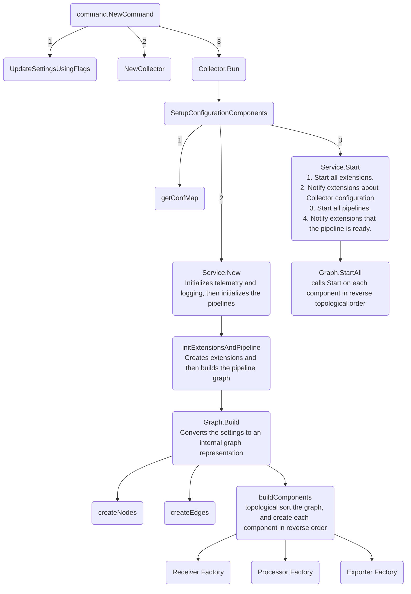

```mermaid
flowchart TD
    A("`command.NewCommand`") -->|1| B("`UpdateSettingsUsingFlags`")
    A --> |2| C("`NewCollector`")
    A --> |3| D("`Collector.Run`")
    D --> E("`SetupConfigurationComponents`")
    E -->  |1| F(getConfMap)
    E ---> |2| G("`Service.New
     Initializes telemetry and logging, then initializes the pipelines`")
    E --> |3| Q("`Service.Start
    1. Start all extensions.
    2. Notify extensions about Collector configuration
    3. Start all pipelines.
    4. Notify extensions that the pipeline is ready.
    `")
    Q --> R("`Graph.StartAll
    calls Start on each component in reverse topological order`")
    G --> H("`initExtensionsAndPipeline
     Creates extensions and then builds the pipeline graph`")
    H --> I("`Graph.Build
     Converts the settings to an internal graph representation`")
    I --> J(createNodes)
    I --> K(createEdges)
    I --> L("`buildComponents
     topological sort the graph, and create each component in reverse order`")
    L --> M(Receiver Factory) & N(Processor Factory) & O(Exporter Factory)
```