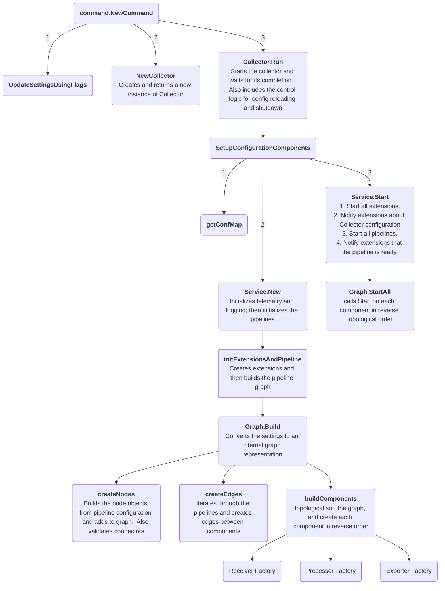

todo: build out config parts (getconfmap).  document how settings and config get rendered

```mermaid
flowchart TD
    A("`**command.NewCommand**`") -->|1| B("`**UpdateSettingsUsingFlags**`")
    A --> |2| C("`**NewCollector**
    Creates and returns a new instance of Collector`")
    A --> |3| D("`**Collector.Run**
    Starts the collector and waits for its completion.  Also includes the control logic for config reloading and shutdown`")
    D --> E("`**SetupConfigurationComponents**`")
    E -->  |1| F("`**getConfMap**`")
    E ---> |2| G("`**Service.New**
     Initializes telemetry and logging, then initializes the pipelines`")
    E --> |3| Q("`**Service.Start**
    1. Start all extensions.
    2. Notify extensions about Collector configuration
    3. Start all pipelines.
    4. Notify extensions that the pipeline is ready.
    `")
    Q --> R("`**Graph.StartAll**
    calls Start on each component in reverse topological order`")
    G --> H("`**initExtensionsAndPipeline**
     Creates extensions and then builds the pipeline graph`")
    H --> I("`**Graph.Build**
     Converts the settings to an internal graph representation`")
    I --> J("`**createNodes**
     Builds the node objects from pipeline configuration and adds to graph.  Also validates connectors`")
    I --> K("`**createEdges**
     Iterates through the pipelines and creates edges between components`")
    I --> L("`**buildComponents**
     topological sort the graph, and create each component in reverse order`")
    L --> M(Receiver Factory) & N(Processor Factory) & O(Exporter Factory)
```