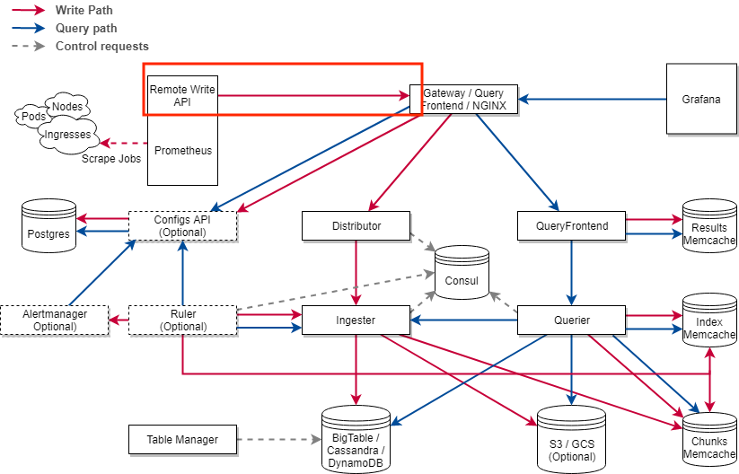

# **OpenTelemetry Collector Prometheus Remote Write/Cortex Exporter Design**

Authors: @huyan0, @danielbang907

Date: July 30, 2020

## **1. Introduction**

Prometheus can be integrated with remote storage systems that supports its remote write API. Existing remote storage integration support is included in [Cortex](https://cortexmetrics.io/docs/api/), [influxDB](https://docs.influxdata.com/influxdb/v1.8/supported_protocols/prometheus/), and many [others](https://prometheus.io/docs/operating/integrations/#remote-endpoints-and-storage).

The following diagram shows an example of Prometheus remote write API usage, with Cortex,n open source, horizontally scalable, highly available, multi-tenant, long term storage, as a remote storage backend.

Our project is focused on developing an exporter for the OpenTelemetry Collector to any Prometheus remote storage backend.

### **1.1 Remote Write API**

The Prometheus remote write/Cortex exporter should write metrics to a remote URL in a snappy-compressed, [protocol buffer](https://github.com/prometheus/prometheus/blob/master/prompb/remote.proto#L22) encoded HTTP request defined by the Prometheus remote write API. Each request should encode multiple Prometheus remote write TimeSeries, which are composed of a set of labels and a collection of samples. Each label contains a name-value pair of strings, and each sample contains a timestamp-value number pair.

TimeSeries stores its metric name in its labels and does not describe metric types or start timestamps. To convert to TimeSeries data, buckets of a Histogram are broken down into individual TimeSeries with a bound label(`le`), and a similar process happens with quantiles in a Summary.

More details of Prometheus remote write API can be found in Prometheus [documentation](https://prometheus.io/docs/prometheus/latest/storage/#overview) and Cortex [documentation](https://cortexmetrics.io/docs/api/).

### **1.2 Gaps and Assumptions**

**Gap 1:**
Currently, metrics from the OpenTelemetry SDKs cannot be exported to Prometheus from the collector correctly ([#1255](https://github.com/open-telemetry/opentelemetry-collector/issues/1255)). This is because the SDKs send metrics to the collector via their OTLP exporter, which exports the delta value of cumulative counters. The same issue will arise for exporting to any Prometheus remote storage backend.

To overcome this gap in the Collector pipeline, we had proposed 2 different solutions:

1. Add a [metric aggregation processor](https://github.com/open-telemetry/opentelemetry-collector/issues/1422) to the collector pipeline to aggregate delta values into cumulative values for cumulative backends. This solution requires users to set up a collector agent next to each SDK to make sure delta values are aggregated correctly.
2. Require the OTLP exporters in SDKs to [send cumulative values for cumulative metric types to the Collector by default](https://github.com/open-telemetry/opentelemetry-specification/issues/731). Therefore, no aggregation of delta metric values is required in the Collector pipeline for Prometheus/storage backends to properly process the data. 

**Gap 2:**
Another gap is that OTLP metric definition is still in development. This exporter will require refactoring as OTLP changes in the future.

**Assumptions:**
Because of the gaps mentioned above, this project will convert from the current OTLP metrics and work under the assumption one of the above solutions will be implemented, and all incoming monotonic scalars/histogram/summary metrics should be cumulative or otherwise dropped. More details on the behavior of the exporter is in section 2.2.

## **2. Prometheus Remote Write/Cortex Exporter**

The Prometheus remote write/Cortex exporter should receive  OTLP metrics, group data points by metric name and label set, convert each group to a TimeSeries, and send all TimeSeries to a storage backend via HTTP.

### **2.1 Receiving Metrics**
The  Prometheus remote write/Cortex exporter receives a MetricsData instance in its PushMetrics() function. MetricsData contains a collection of Metric instances. Each Metric instance contains a series of data points, and each data point has a set of labels associated with it. Since Prometheus remote write TimeSeries are identified by unique sets of labels, the exporter needs to group data points within each Metric instance by their label set, and convert each group to a TimeSeries.

To group data points by label set, the exporter should create a map with each PushMetrics() call. The key of the map should represent a combination of the following information:

* the metric type
* the metric name
* the set of labels that identify a unique TimeSeries

The exporter should create a signature string as map key by concatenating metric type, metric name, and label names and label values at each data point. To ensure correctness, the label set at each data point should be sorted by label key before generating the signature string.  

An alternative key type is in the exiting label.Set implementation from the OpenTelemetry Go API. It provides a Distinct type that guarantees the result will equal the equivalent Distinct value of any label set with the same elements as this,  where sets are made unique by choosing the last value in the input for any given key. If we allocate a Go API's kv.KeyValue for every label of a data point, then a label.Set from the API can be created, and its Distinct value can be used as map key.

The value of the map should be Prometheus TimeSeries, and each data point’s value and timestamp should be inserted to its corresponding TimeSeries in the map as a Sample, each metric’s label set and metric name should be combined and translated to a Prometheus label set; a new TimeSeries should be created if the string signature is not in the map. 

Pseudocode:

        func  PushMetrics(metricsData) {

         // Create a map that stores distinct TimeSeries
         map := make(map[String][]TimeSeries)

         for metric in metricsData:
	         for point in metric:
	           // Generate signature string
	           sig := pointSignature(metric, point)

	           // Find corresponding TimeSeries in map
	           // Add to TimeSeries

	      // Sends TimeSeries to backend
          export(map)  
       }

### **2.2 Mapping of OTLP Metrics to TimeSeries**

Each Prometheus remote write TimeSeries represents less semantic information than an OTLP metric. The temporality property of a OTLP metric is ignored in a TimeSeries because it is always considered as cumulative for monotonic types and histogram, and the type property of a OTLP metric is translated by mapping each metric to one or multiple TimeSeries. The following sections explain how to map each OTLP metric type to Prometheus remote write TimeSeries.

**INT64, MONOTONIC_INT64, DOUBLE, MONOTONIC_DOUBLE**

Each unique label set within metrics of these types can be converted to exactly one TimeSeries. From the perspective of Prometheus client types, INT64 and DOUBLE correspond to gauge metrics, and MONOTONIC types correspond to counter metrics. In both cases, data points will be exported directly without aggregation. Any metric of the monotonic types that is not cumulative should be dropped; non-monotonic scalar types are assumed to represent gauge values, thus its temporality is not checked. Monotonic types need to have a `_total` suffix in its metric name when exporting; this is a requirement of Prometheus.

**HISTOGRAM**

Each histogram data point can be converted to 2 + n + 1 Prometheus remote write TimeSeries:

* 1 *TimeSeries* representing metric_name_count contains HistogramDataPoint.count
* 1 *TimeSeries* representing metric_name_sum contains HistogramDataPoint.sum
* n *TimeSeries* each representing metric_name_bucket{le=“upperbound”} contain the count of each bucket defined by the bounds of the data point
* 1 *TimeSeries* representing metric_name_bucket{le=“+Inf”} contains counts for the bucket with infinity as upper bound; its value is equivalent to metric_name_count.

Prometheus bucket values are cumulative, meaning the count of each bucket should contain counts from buckets with lower bounds. In addition, Exemplars from a histogram data point are ignored. When adding a bucket of the histogram data point to the map, the string signature should also contain a `le` label that indicates the bound value. This label should also be exported. Any histogram metric that is not cumulative should be dropped.

**SUMMARY**

Each summary data point can be converted to 2 + n Prometheus remote write TimeSeries:

* 1 *TimeSeries* representing metric_name_count contains SummaryDataPoint.count
* 1 *TimeSeries* representing metric_name_sum contains SummaryDataPoint.sum
* and n *TimeSeries* each representing metric_name{quantile=“quantileValue”} contains the value of each quantile in the data point.

When adding a quantile of the summary data point to the map, the string signature should also contain a `quantile ` label that indicates the quantile value. This label should also be exported. Any summary metric that is not cumulative should be dropped.

### **2.3 Exporting Metrics**

The Prometheus remote write/Cortex exporter should call proto.Marshal() to convert multiple TimeSeries to a byte array. Then, the exporter should send the byte array to Prometheus remote storage in a HTTP request.

Authentication credentials should be added to each request before sending to the backend. Basic auth and bearer token headers can be added using Golang http.Client’s default configuration options. Other authentication headers can be added by implementing a client interceptor.

Pseudocode:

      func export(*map) error {
        	// Stores timeseries
        	arr := make([]TimeSeries)

        	for timeseries in map:
        		arr = append(arr, timeseries)

        		// Converts arr to WriteRequest
        		request := proto.Marshal(arr)

        	// Sends HTTP request to endpoint
        }

## **3. Other Components**

### **3.1 Config Struct**

This struct is based on an inputted YAML file at the beginning of the pipeline and defines the configurations for an Exporter build. Examples of configuration parameters are HTTP endpoint, compression type, backend program, etc.

Converting YAML to a Go struct is done by the Collector, using [_the Viper package_](https://github.com/spf13/viper), which is an open-source library that seamlessly converts inputted YAML files into a usable, appropriate Config struct.

An example of the exporter section of the Collector config.yml YAML file can be seen below:

    ...

    exporters:
      prometheus_remote_write:
        http_endpoint: <string>
        # Prefix to metric name
        namespace: <string>
        # Labels to add to each TimeSeries
        const_labels:
            [label: <string>]
        # Allow users to add any header; only required headers listed here
        headers:
            [X-Prometheus-Remote-Write-Version:<string>]
            [Tenant-id:<int>]
        request_timeout: <int>

        # ************************************************************************
        # below are configurations copied from Prometheus remote write config   
        # ************************************************************************
        # Sets the `Authorization` header on every remote write request with the
        # configured username and password.
        # password and password_file are mutually exclusive.
        basic_auth:
        [ username: <string> ]
        [ password: <string> ]
        [ password_file: <string> ]

        # Sets the `Authorization` header on every remote write request with
        # the configured bearer token. It is mutually exclusive with `bearer_token_file`.
        [ bearer_token: <string> ]

        # Sets the `Authorization` header on every remote write request with the bearer token
        # read from the configured file. It is mutually exclusive with `bearer_token`.
        [ bearer_token_file: /path/to/bearer/token/file ]

        # Configures the remote write request's TLS settings.
        tls_config:
            # CA certificate to validate API server certificate with.
            [ ca_file: <filename> ]

            # Certificate and key files for client cert authentication to the server.
            [ cert_file: <filename> ]
            [ key_file: <filename> ]

            # ServerName extension to indicate the name of the server.
            # https://tools.ietf.org/html/rfc4366#section-3.1
            [ server_name: <string> ]

            # Disable validation of the server certificate.
            [ insecure_skip_verify: <boolean> ]

    ...

### **3.2 Factory Struct**

This struct implements the ExporterFactory interface, and is used during collector’s pipeline initialization to create the Exporter instances as defined by the Config struct. The `exporterhelper` package will be used to create the exporter and the factory.

Our Factory type will look very similar to other exporters’ factory implementation. For our implementation, our Factory instance will implement three methods

**Methods**

    NewFactory
This method will use the NewFactory method within the `exporterhelper` package to create a instance of the factory.

    createDefaultConfig

This method creates the default configuration for Prometheus remote write/Cortex exporter.

    createMetricsExporter

This method constructs a new http.Client with interceptors that add headers to any request it sends. Then, this method initializes a new Prometheus remote write exporter/Cortex exporter with the http.Client. This method constructs a collector Prometheus remote write/Cortex exporter exporter with the created SDK exporter 

## **4. Other Considerations**

### **4.1 Concurrency**

The Prometheus remote write/Cortex exporter should be thread-safe; In this design, the only resource shared across goroutines is the http.Client from the Golang library. It is thread-safe, thus, our code is thread-safe. 

### **4.2 Shutdown Behavior**

Once the shutdown() function is called, the exporter should stop accepting incoming calls(return error), and wait for current operations to finish before returning. This can be done by using a stop channel and a wait group.

    func Shutdown () {
        close(stopChan)
        waitGroup.Wait()
    }

    func PushMetrics() {
	    select:
	        case <- stopCh
	               return error
	        default:
	               waitGroup.Add(1)
	               defer waitGroup.Done()
	               // export metrics
		  ...
    }

### **4.3 Timeout Behavior**

Users should be able to pass in a time for the each http request as part of the Configuration. The factory should read the configuration file and set the timeout field of the http.Client

    func (f *Factory) CreateNewExporter (config) {
    ...
        client := &http.Client{
                Timeout config.requestTimeout
        }
    ...
    }

### **4.4 Error Behavior**

The PushMetricsData() function should return the number of dropped metrics. Any monotonic and histogram metrics that are not cumulative should be dropped. This can be done by checking the temporality of each received metric. Any error should be returned to the caller, and the error message should be descriptive. 

### **4.5 Test Strategy**

We will follow test-driven development practices while completing this project. We’ll write unit tests before implementing production code. Tests will cover normal and abnormal inputs and test for edge cases. We will provide end-to-end tests using mock backend/client. Our target is to get 90% or more of code coverage.

## **Request for Feedback**
We'd like to get some feedback on whether we made the appropriate assumptions in [this](#1.2-gaps-and-ssumptions) section, and appreciate more comments, updates , and suggestions on the topic.

Please let us know if there are any revisions, technical or informational, necessary for this document. Thank you!

