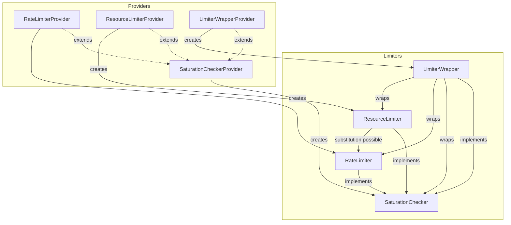

# OpenTelemetry Collector Extension Limiter Package

**Document status: development**

The `extensionlimiter` package provides interfaces for limiting
pipelines in the OpenTelemetry Collector, enabling control over data
flow and resource usage through extensions which are configured
through middleware and/or directly by pipeline components.

## Overview

This package defines three foundational limiter **kinds**, each with
similar but distinct interfaces.  A limiter extension is either a
basic limiter, or it implements the basic limiter interface and one of
the weight-based interfaces:

- **Basic Limiter**: Makes a simple yes/no decision without a weight
  parameter, typically to stop new work in an emergency.
- **Rate Limiter**: Controls time-based limits over weights such as
  bytes or items per second.
- **Resource Limiter**: Controls physical limits over weights such as
  concurrent requests or active memory in use.

For the two weight-based limiters, requests are quantified with an
integer value and identified by a **weight key** indicating the type
of quantity being measured and limited. There are currently four
weight keys with a standard definition:

1. Network bytes
2. Request count
3. Request items
4. Memory size

The foundational interfaces are non-blocking, and each calling
convention is different.  The various limiter kinds are unified
through a `LimiterWrapper` interface, which simplifies consumers in
many cases by providing a consistent `LimitCall` interface for each
limiter kind using a synchronous callback. Limiter wrappers provide an
abstraction over the details of requesting the limit, blocking the
caller temporarily (considering deadline), and making the call.

There are circumstances where the kind of limiter matters. For
example, in current middleware, the network bytes weight key can be
measured through a `grpc.StatsHandler` or an `io.ReadCloser`, and in
both cases the resource (e.g., byte slice, pdata object) remains in
use after the method returns. These callers can apply rate limit and
basic limits, but they cannot apply resource limits.

The kind of limiter matters in other situations where program control
flow does not permit the use of a wrapper, especially as needed to
maintain back-pressure in a pipeline. In a streaming asynchronous
receiver (e.g.,
[otelarrowreceiver](https://github.com/open-telemetry/opentelemetry-collector-contrib/blob/main/receiver/otelarrowreceiver/README.md)),
for example, a limiter can slow the arrival of new data by stalling a
response, it means synchronously waiting for the limit and
asynchronously processing the request.

A limiter is defined as **saturated** when a limit is completely
overloaded for at least one weight, generally it means callers should
deny new requests. All limiter extensions implement the basic limiter
interface, and callers are expected to check for saturation by
invoking `CheckSaturation` before making individual requests with the limiter.

Whereas the basic limiter's `CheckSaturation` method indicates only
saturation, the rate and resource limiter interfaces both return a
`Reservation`. While the details are slightly different, the
reservation generally has two features:

- a mechanism to wait for the limit
- a mechanism to cancel or release the request.

Each kind of limiter have corresponding **provider** interfaces that
return a specific limiter instance based on a weight key. Components
are expected to initialize limiters during startup, through limiter
extension providers (which may produce configuration errors).

All limiter extensions:

- MUST implement the `SaturationCheckerProvider` interface
- MUST NOT implement both the `ResourceLimiterProvider` and the `RateLimiterProvider` interfaces

The `limiterhelper` package contains features for composing limiters
as well as foundational rate and resource limiter implementations.
The `limiterhelper/http` and `limiterhelper/grpc` packages provide
connectors allowing limiters to act as specific kinds of
middleware. Limiters are automatically initialized as middleware via
`configmiddleware`.  The original garbage-collector state-based
limiter can be found in
[`../memorylimiterextension`](../memorylimiterextension/README.md).

## Recommendations

For processors, exporters, and sometimes receivers, the easiest way to
integrate with any kind of limiter is to use the a consumer wrapper
function (e.g. `NewLimitedLogs`). These helper methods check for
saturation and then apply multiple weight keys in sequence. 

At a lower level, a simple way to integrate with any kind of limiter
is to use the `LimiterWrapper` interface with its callback-based
approach.

Multi-limiter adapters are available for all provider interfaces via
`MultipleProvider`.

For blocking access to rate and resource limiters without wrapper
constraints, use `NewBlockingRateLimiter` or `NewBlockingResourceLimiter`.

In cases where control flow is not request scoped (e.g., in middleware
measuring network bytes), use a `RateLimiter` interface. If the
extension is a basic limiter in this scenario, use the
`BaseToRateLimiterProvider` adapter. Callers MUST NOT configure a
resource limiter for a caller that is restricted to the `RateLimiter`
interface; this configuration SHOULD fail at startup or during
component validation.

In cases where due to control flow a wrapper interface cannot be used,
as long as the caller is able to arrange for a `Release` function to
be called at the proper time, then any kind of limiter can be applied
in the form of a `ResourceLimiter`.  If the extension is a basic or
rate limiter in this scenario, use the `BaseToResourceLimiterProvider`
or `RateToResourceLimiterProvider` adapters.

Middleware configuration typically automates the configuration of
network bytes and request count weight keys relatively early in a
pipeline.  Receivers are responsible for limiting request items and
memory size through one of the available helpers. 

Processors can apply limiters for specific reasons, for example to
apply limits in data-dependent ways.  Exporters can apply limiters for
the same reasons, for example to apply limits in destination-dependent
ways.

### Limiter blocking and failing

Limiters implementations are not expected to block.  The `RateLimiter`
and `ResourceLimiter` interfaces return reservations instead,
informing the caller how they can wait on their own and allowing them
to cancel the request if they return early.

Limiter implementations SHOULD consider the context deadline when they
block. If the deadline is likely to expire before the limit becomes
available, they should return an error instead.  Blocking adapters are
provided for callers including the `LimiterWrapper`.

### Limiter saturation

Rate and resource limiter providers have a `GetSaturationChecker` method to
provide a `SaturationChecker`, featuring a `CheckSaturation` method which is made
available for applications to test when any limit is fully
saturated that would eventually deny the request.

The `SaturationChecker` is consulted at least once and applies to all weight
keys.  Because a `SaturationChecker` can be consulted more than once by a
receiver and/or middleware, it is possible for requests to be denied
over the saturation of limits they were already granted. Users should
configure external load balancers and/or horizontal scaling policies
to avoid cases of limiter saturation.

### Limit before or after use

It is sometimes possible to request a limit before it is actually
used. As an example, consider a protocol using a compressed payload,
such that the receiver knows how much memory will be allocated before
the fact. In this case the receiver can request the limit before using
it, but this will not always be the case. Generally, prefer to limit
before use, but either way be consistent.

When using the low-level interfaces directly, limits SHOULD be applied
before creating new concurrent work.

### Built-in limiters

#### Base

The `memorylimiterextension` is a `SaturationCheckerProvider` that makes its
decisions using memory statistics from the garbage collector. This
logic was traditionally included in the `memorylimiterprocessor`,
however receiver integration with limiter extensions is preferred.

#### Rate

A built-in helper implementation of the RateLimiter interface is
provided, based on `golang.org/x/time/rate.Limter`. These underlying
rate limiters are parameterized by two numbers:

- `limit` (float64): the maximum frequency of weight-units per second
- `burst` (uint64): the "burst" value of the Token-bucket algorithm.

The rate limiter is saturated when there is no burst available.

#### Resource

A built-in helper implementation of the ResourceLimiter interface is
provided, based on a bounded queue with LIFO behavior.  These
underlying resource limiters are parameterized by two numbers:

- `request` (uint64): the maximum of concurrent resource value admitted
- `waiting` (uint64): the maximum of concurrent resource value permitted to wait

The resource limiter is saturated when the sum of current `request`
and `waiting` values exceed the sum of their maximum values.

### Examples

#### OTLP receiver

Limiters applied through middleware are an implementation detail,
simply configure them using `configgrpc` or `confighttp`. For the
OTLP receiver (e.g., with two `ratelimiter` extensions):

```yaml
extensions:
  ratelimiter/limit_for_grpc:
    # rate limiter settings for gRPC
  ratelimiter/limit_for_grpc:
    # rate limiter settings for HTTP

receivers:
  otlp:
    protocols:
      grpc:
        middlewares:
        - ratelimiter/limit_for_grpc
      http:
        middlewares:
        - ratelimiter/limit_for_http
```

Note that the OTLP receiver specifically supports multiple protocols
with separate middleware configurations, thus it configures limiters
for request items and memory size on a protocol-by-protocol basis.

#### HTTP metrics scraper

A HTTP pull-based receiver can implement a basic limited scraper loop
as follows. The HTTP client config object's `middlewares` field
automatically configures network bytes and request count limits:

```yaml
receivers:
  scraper:
    http:
      middlewares:
      - ratelimiter/scraper
```

Limiter extensions are derived from a host, a middlewares list, and a
list of weight keys. When middleware is configurable at the factory
level, it may be added via `receiver.NewFactory` using
`receiver.WithLimiters(getLimiters)`:

```golang
func NewFactory() receiver.Factory {
    return xreceiver.NewFactory(
        metadata.Type,
        createDefaultConfig,
        xreceiver.WithMetrics(createMetrics, metadata.MetricsStability),
        xreceiver.WithLimiters(getLimiters),
    )
}
```

Here, `getLimiters` is a function to get the effective
`[]configmiddleware.Config` and derive pipeline consumers using
`limiterhelper` adapters.

To acquire a limiter, use `MiddlewaresToLimiterProvider` to
obtain a combined limiter wrapper around the input `nextMetrics`
consumer. It will pass `StandardNotMiddlewareKeys()` indicating to
apply request items and memory size:

```golang
    // Extract limiter extensions from host and list of middleware.
    providers, err := configmiddleware.GetSaturationCheckers(
        host, cfg.Middlewares)
    if err != nil { ... }
	
	// Extract a multi-limiter from the provider
	s.limiterProvider, err = limiterhelper.MultipleProvider(providers)
	if err != nil { ... }

    // Here get a limiter-wrapped pipeline and a combination of weight-specific
    // limiters for CheckSaturation() functionality.
	limitKeys := extensionlimiter.StandardNotMiddlewareKeys()
    s.nextMetrics, err = limiterhelper.NewLimitedMetrics(
        s.nextMetrics, limitKeys, s.limiterProvider)
    if err != nil { ... }

    // Compute the base limiter from the middlewares for use before scrapes.
	s.limiter, err := s.limiterProvider.GetSaturationChecker(host, middlewares)
	if err != nil { ... }
```

In the scraper loop, use `CheckSaturation` before starting a scrape:

```golang
func (s *scraper) scrapeOnce(ctx context.Context) error {
	// Check if any limits are saturated.
    if err := s.limiter.CheckSaturation(ctx); err != nil {
        return err
    }

    // Network bytes and request count limits are applied in middleware.
    // before this returns:
    data, err := s.getData(ctx)
    if err != nil {
        return err
    }

    // Request items and memory size are applied in the pipeline.
    return s.nextMetrics.ConsumeMetrics(ctx, data)
}
```

#### gRPC stream receiver

A gRPC streaming receiver that holds memory across its allocated in
`Send()` and does not release it until after a corresponding `Recv()`
requires use of the lower-level `ResourceLimiter` interface.
The gRPC  config object's `middlewares` field
automatically configures network bytes and request count limits:

```yaml
receivers:
  streamer:
    grpc:
      middlewares:
      - ratelimiter/streamer
```

The receiver will check `s.limiter.CheckSaturation()` as above.  In a stream,
a blocking limiter is used which blocks the stream (via
`s.requestSizeLimiter.WaitFor()`) until limit requests succeed, however
after the limit requests succeed, the receiver returns from `Send()`
to continue accepting new requests while the consumer works in a
separate goroutine. The limit will be released after the consumer
returns in this example:

```golang
func (s *scraper) LogsStream(ctx context.Context, stream *Stream) error {
    for {
        // Check saturation for all limiters, all keys.
        err := s.limiter.CheckSaturation(ctx)
        if err != nil { ... }

        // The network bytes and request count limits are applied in middleware.
        req, err := stream.Recv()
        if err != nil { ... }

        // Allocate memory objects.
        data, err := s.getLogs(ctx, req)
        if err != nil { ... }

        // Non-blocking limiter call.
        release, err := s.requestSizeLimiter.WaitFor(ctx, pdataSize(data))
        if err != nil { ... }

        // Asynchronous work starts here.
        go func() {
            // Request items limit is applied in the pipeline consumer
            err := s.nextMetrics.ConsumeMetrics(ctx, data)

            // Release the memory.
            release()

            // Reply to the caller.
            stream.Send(streamResponseFromConsumerError(err))
        }
    }
}
```

##### Data-dependent limits

When a single unit of data contains limits that are assignable to
multiple distinct limiters, one option available to users is to split
requests and add to their context and run them concurrently through
context-dependent limiters.  See
[#39199](https://github.com/open-telemetry/opentelemetry-collector-contrib/issues/39199).

Another option, shown below, is to use the non-blocking rate limiter
interface and drop data that would exceed a limit.  For example, to
limit based on metadata extracted from the OpenTelemetry resource
value:

```
func (p *processor) limitLogs(ctx context.Context, logsData plog.Logs) (plog.Logs, extensionlimiter.ReleaseFunc, error) {
    var rels extensionlimiter.ReleaseFuncs
	logsData.ResourceLogs().RemoveIf(func(rl plog.ResourceLogs) bool {
		md := resourceToMetadata(rl.Resource())
		reservation, err := p.limiter.ReserveRate(withMetadata(ctx, md))
		if err != nil {
		    return false
		}
		if reservation.WaitTime() > 0 {
			reservation.Cancel()
			return false
		}
		default:
			return true
		}
	})
	if logsData.ResourceLogs().Len() == 0 {
		return logsData, func() {}, processorhelper.ErrSkipProcessingData
	}
	return logsData, rels.Release, nil
}

func (p *processor) ConsumeLogs(ctx context.Context, logsData plog.Logs) error {
	logsData, release, err = limitLogs(ctx, logsData)
	if err != nil {
	    return err
	}
	defer release()
	return p.nextLogs.ConsumeLogs(ctx, logsData)
}
```

Here, the limiter's `ReserveRate` function does not block the caller,
allowing the processor to drop data instead.  Note the call to
`RateReservation.Cancel` undoes the effect of the untaken reservation.
The same approach works for `ResourceLimiter` as well using using
`ResourceReservation`, its `Delay` channel `Release` function.

#### Open questions

##### Provider options

An `Option` type has been added as a placeholder in the provider
interfaces. **NOTE: No options are implemented.** Potential options:

- The protocol name
- The signal kind
- The caller's component ID

Because the set of each of these is small, it is possible to
pre-compute limiter instances for the cross product of configurations.

## Architecture

The following diagram illustrates the core architecture of the extension limiter system, showing the relationships between interfaces, providers, helpers, and middleware integration:


