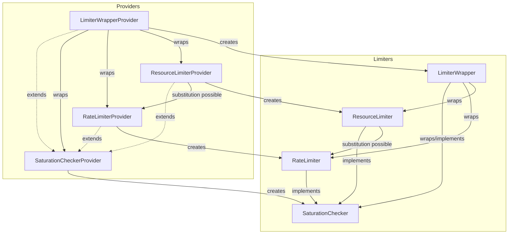

# OpenTelemetry Collector Extension Limiter Package

**Document status: development**

The `extensionlimiter` package provides interfaces for limiting
pipelines in the OpenTelemetry Collector, enabling control over data
flow and resource usage through extensions which are configured
through middleware and/or directly by pipeline components.

## Overview

This package defines two foundational limiter **kinds**, with similar
but distinct interfaces.  A limiter extension can be:

- **Rate Limiter**: Controls time-based limits over weights such as
  bytes or items per second.
- **Resource Limiter**: Controls physical limits over weights such as
  concurrent requests or active memory in use.

Requests are quantified with an integer value and identified by
**weight key**, indicating the type of quantity being measured and
limited. There are currently four weight keys with a standard
definition:

1. Network bytes (compressed)
2. Request count
3. Request items
4. Request bytes (uncompressed)

## Early-as-possible application

Limiter extensions should be used as early as possible in a
pipeline. There are two automatic ways that receivers can integrate
with rate limiters:

- Middleware application: rate limiters are automatically recognized
  in the list of middleware. Middleware supports HTTP and gRPC, client
  and server, unary and streaming cases. Middleware automatically
  implements request bytes and request count limits.
- Consumer application: rate limiters can be applied before the next
  consumer in the pipeline, using standard `consumerlimiter.LimiterConfig`
  configuration.

Limiters should be applied, if possible, before work on a request
begins. Work that is done before a limit is requested is subject to
loss, in case the limiter causes failure.

Limiters are not always applied in receivers, but all receivers should
support limiters through middleware and/or `consumerlimiter`.

## Delay-the-caller application

Limiters should be applied so that they delay the caller. This is an
important case of the early-as-possible rule: limit requests should be
made before returning control, in order to slow the process that is
contributing to the limit.

In order to support delaying the caller in complex scenarios,
non-blocking interfaces are provided for each of the limiter
interfaces. Non-blocking APIs allow callers to delay the caller while
requesting the limit and then to perform their work asynchronously.

The `limiterhelper.Wrapper` limiter interface is provided which
simplifies the application of limits to a scoped callback, making it
easy to use a blocking limit request.

## Failure options

Limiters at their discretion can block or fail requests that would
exceed a limit. The decision may influenced by limiter configuration
(e.g., burst, maximum wait parameters) and/or the deadline of the
request context. When the delay is small, it is usually beneficial to
wait instead of failing because (a) avoids the wasted effort (e.g.,
re-transmitting data), (b) delays the caller for the effect of
back-pressure.

When a limiter returns failure, the client should return a
protocol-specific failure code indicating resource exhaustion. The
recognized resource exhaustion codes are HTTP 429 and gRPC
RESOURCE_EXHAUSTED. Receivers should follow protocol-specific
recommendations, which for
[OTLP](https://opentelemetry.io/docs/specs/otlp/) includes returning a
`RetryDelay` parameter.

If the limit request results in waiting, limiters should delay to
allow the request to proceed, however they should give up and return
at some point. As a recommendation, receivers and other components
should allow requests to wait up to configurable fraction of their
deadline. If the request cannot enter a pipeline before for example
half of its deadline, return failure instead of allowing it to
proceed.

## Limiter configuration

Limiters are configurable the same way middleware are configured, by
referring to the name of the extension component.

### Built-in limiters

#### MemoryLimiter

The `memorylimiterextension` gives access to an internal component
named `MemoryLimiter` with an interface named `MustDeny()`.
Components can call this component directly, however when configured
as a limiter extension, this component is modeled as a `RateLimiter`
that is on or off based on the current result of `MustDeny`.

#### RateLimiter

A built-in helper implementation of the RateLimiter interface is
provided, based on `golang.org/x/time/rate.Limter`. These underlying
rate limiters are parameterized by two numbers:

- `limit` (float64): the maximum frequency of weight-units per second
- `burst` (uint64): the "burst" value of the Token-bucket algorithm.

#### ResourceLimiter

A built-in helper implementation of the ResourceLimiter interface is
provided, based on a bounded queue with LIFO behavior.  These
underlying resource limiters are parameterized by two numbers:

- `request` (uint64): the maximum of concurrent resource value admitted
- `waiting` (uint64): the maximum of concurrent resource value permitted to wait

### Examples

#### OTLP receiver

Limiters applied through middleware and/or via receiver-level
limiters.  Middleware limiters are automatically configured using
`configgrpc` or `confighttp`. Receivers can add support at the factory
level using helpers in `consumerlimiter`.

For the OTLP receiver (e.g., with three `ratelimiter` extensions and a
`resourcelimiter` extension):

```yaml
extensions:
  ratelimiter/limit_for_grpc:
    network_bytes: ...

  ratelimiter/limit_for_http:
    network_bytes: ...

  ratelimiter/limit_items:
    request_items: ...

  resourcelimiter/limit_memory:
    request_bytes: ...

receivers:
  otlp:
    protocols:
      grpc:
        middleware:
        - ratelimiter/limit_for_grpc
        - resourcelimiter/limit_memory
      http:
        middleware:
        - ratelimiter/limit_for_http
        - resourcelimiter/limit_memory
    limiters:
      request_items: ratelimiter/limit_items
```

Note that in general, middleware components do not have access to the
number of items in a request, so users are directed to receiver-level
`limiters` configuration to limit items. The OTLP receiver uses the
helper library to configure its factory:

```golang
func NewFactory() receiver.Factory {
	return consumerlimiter.NewLimitedFactory(
		receiver.NewFactory(
			metadata.Type,
			createDefaultConfig,
			receiver.WithTraces(createTraces, metadata.TracesStability),
			receiver.WithMetrics(createMetrics, metadata.MetricsStability),
			receiver.WithLogs(createLog, metadata.LogsStability),
			receiver.WithProfiles(createProfiles, metadata.ProfilesStability),
		),
		func(cfg component.Config) consumerlimiter.LimiterConfig {
			return cfg.(*Config).LimiterConfig
		},
	)
}
```

#### HTTP metrics scraper

A HTTP pull-based receiver can implement a basic limited scraper loop
as follows. The HTTP client config object's `middlewares` field
automatically configures network bytes and request count limits:

```yaml
receivers:
  scraper:
    http:
      limiters:
        request_ratelimiter/scraper
```

Limiter extensions are derived from a host, a middlewares list, and a
list of weight keys. When middleware is configurable at the factory
level, it may be added via `receiver.NewFactory` using
`receiver.WithLimiters(getLimiters)`:

```golang
func NewFactory() receiver.Factory {
	return consumerlimiter.NewLimitedFactory(
		receiver.NewFactory(
			metadata.Type,
			createDefaultConfig,
			xreceiver.WithMetrics(createMetrics, metadata.MetricsStability),
		),
		func(cfg component.Config) consumerlimiter.LimiterConfig {
		        cpy := cfg.(*Config).LimiterConfig
			// RequestCount checked in scraper loop, reset it here:
			cpy.RequestCount = component.ID{}
			return 
		},
	)
}
```

Here, the second argument to `consumerlimiter.NewLimitedFactory`
is a function providing the `LimiterConfig` struct to be applied
automatically before the next consumer in the pipeline.

In the scraper loop, use `CheckSaturation` before starting a scrape:

```golang
func (s *scraper) scrapeOnce(ctx context.Context) error {
	// Check if any limits are saturated.
    if err := s.limiter.CheckSaturation(ctx); err != nil {
        return err
    }

    // Network bytes and request count limits are applied in middleware.
    // before this returns:
    data, err := s.getData(ctx)
    if err != nil {
        return err
    }

    // Request items and memory size are applied in the pipeline.
    return s.nextMetrics.ConsumeMetrics(ctx, data)
}
```

#### gRPC stream receiver

A gRPC streaming receiver that holds memory across its allocated in
`Send()` and does not release it until after a corresponding `Recv()`
requires use of the lower-level `ResourceLimiter` interface.
The gRPC  config object's `middlewares` field
automatically configures network bytes and request count limits:

```yaml
receivers:
  streamer:
    grpc:
      middlewares:
      - ratelimiter/streamer
```

The receiver will check `s.limiter.CheckSaturation()` as above.  In a stream,
a blocking limiter is used which blocks the stream (via
`s.requestSizeLimiter.WaitFor()`) until limit requests succeed, however
after the limit requests succeed, the receiver returns from `Send()`
to continue accepting new requests while the consumer works in a
separate goroutine. The limit will be released after the consumer
returns in this example:

```golang
func (s *scraper) LogsStream(ctx context.Context, stream *Stream) error {
    for {
        // Check saturation for all limiters, all keys.
        err := s.limiter.CheckSaturation(ctx)
        if err != nil { ... }

        // The network bytes and request count limits are applied in middleware.
        req, err := stream.Recv()
        if err != nil { ... }

        // Allocate memory objects.
        data, err := s.getLogs(ctx, req)
        if err != nil { ... }

        // Non-blocking limiter call.
        release, err := s.requestSizeLimiter.WaitFor(ctx, pdataSize(data))
        if err != nil { ... }

        // Asynchronous work starts here.
        go func() {
            // Request items limit is applied in the pipeline consumer
            err := s.nextMetrics.ConsumeMetrics(ctx, data)

            // Release the memory.
            release()

            // Reply to the caller.
            stream.Send(streamResponseFromConsumerError(err))
        }
    }
}
```

##### Data-dependent limits

When a single unit of data contains limits that are assignable to
multiple distinct limiters, one option available to users is to split
requests and add to their context and run them concurrently through
context-dependent limiters.  See
[#39199](https://github.com/open-telemetry/opentelemetry-collector-contrib/issues/39199).

Another option, shown below, is to use the non-blocking rate limiter
interface and drop data that would exceed a limit.  For example, to
limit based on metadata extracted from the OpenTelemetry resource
value:

```
func (p *processor) limitLogs(ctx context.Context, logsData plog.Logs) (plog.Logs, extensionlimiter.ReleaseFunc, error) {
    var rels extensionlimiter.ReleaseFuncs
	logsData.ResourceLogs().RemoveIf(func(rl plog.ResourceLogs) bool {
		md := resourceToMetadata(rl.Resource())
		reservation, err := p.limiter.ReserveRate(withMetadata(ctx, md))
		if err != nil {
		    return false
		}
		if reservation.WaitTime() > 0 {
			reservation.Cancel()
			return false
		}
		default:
			return true
		}
	})
	if logsData.ResourceLogs().Len() == 0 {
		return logsData, func() {}, processorhelper.ErrSkipProcessingData
	}
	return logsData, rels.Release, nil
}

func (p *processor) ConsumeLogs(ctx context.Context, logsData plog.Logs) error {
	logsData, release, err = limitLogs(ctx, logsData)
	if err != nil {
	    return err
	}
	defer release()
	return p.nextLogs.ConsumeLogs(ctx, logsData)
}
```

Here, the limiter's `ReserveRate` function does not block the caller,
allowing the processor to drop data instead.  Note the call to
`RateReservation.Cancel` undoes the effect of the untaken reservation.
The same approach works for `ResourceLimiter` as well using using
`ResourceReservation`, its `Delay` channel `Release` function.

#### Open questions

##### Provider options

An `Option` type has been added as a placeholder in the provider
interfaces. **NOTE: No options are implemented.** Potential options:

- The protocol name
- The signal kind
- The caller's component ID

Because the set of each of these is small, it is possible to
pre-compute limiter instances for the cross product of configurations.

## Architecture

The following diagram illustrates the core architecture of the extension limiter system, showing the relationships between interfaces, providers, helpers, and middleware integration:



TODO describe connection with
https://github.com/elastic/opentelemetry-collector-components/blob/main/processor/ratelimitprocessor/README.md
