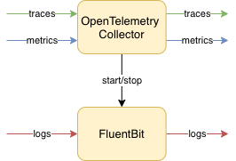
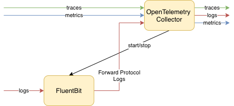

# FluentBit Subprocess Extension

**This extension is experimental and may receive breaking changes or be removed
at any time.**

The `fluentbit` extension facilitates running a FluentBit subprocess of the
collector. You are responsible for providing a configuration to FluentBit via the `config`
config option.  This will be provided to FluentBit subprocess, along with a few other
config options to enhance the integration with the collector.       

There are 2 typical ways to use Fluent Bit and Collector together: side-by-side
and chained.

## Side-by-side

With this approach Collector is responsible for traces and metrics and
Fluent Bit is responsible for logs. `fluentbit` extension is used to start/stop and
provide configuration to Fluent Bit:



### Chained

In this approach we use `fluentbit` extension in conjunction with the `fluentforward`
receiver such that the FluentBit process will be configured to send to the
TCP socket opened by the `fluentforward` receiver:



`fluentbit` extension does not actually listen for the logs from FluentBit, 
it just starts a FluentBit subprocess that will generally send to a `fluentforward` 
receiver, which must be configured separately.

The downside of the chained approach is that log data is serialized and deserialized
when going from Fluent Bit to Collector, which has performance implications. The benefit
is that all logs are passed through the Collector which allows log data to be processed
inside the Collector uniformly with traces and metrics (e.g. the same attributes added
to all 3 signals if needed) and also allows to export logs in the formats supported
by the Collector, which Fluent Bit does not necessarily support.

**As of now, this extension is only targeted for Linux environments.  It does not
work on Windows or MacOS.**

Note: if you are only collecting logs and not traces or metrics it is likely simpler
to use Fluent Bit alone without Collector.

## Example Config

```yaml
extensions:
  health_check:
  fluentbit:
    executable_path: /usr/src/fluent-bit/build/bin/fluent-bit
    tcp_endpoint: 127.0.0.1:8006
    config: |
      [SERVICE]
          parsers_file /usr/src/fluent-bit/conf/parsers.conf
      [INPUT]
          name tail
          path /var/log/mylog
          parser apache
receivers:
  fluentforward:
    endpoint: 0.0.0.0:8006
  prometheus:
    config:
      scrape_configs:
        - job_name: 'otel-collector'
          scrape_interval: 1s
          static_configs:
            - targets: ['127.0.0.1:8888']
        # This will connect to the Fluent Bit subprocess's built-in HTTP
        # monitoring server to grab Promtheus metrics.
        - job_name: 'fluentbit'
          scrape_interval: 1s
          metrics_path: '/api/v1/metrics/prometheus'
          static_configs:
            - targets: ['127.0.0.1:2020']
service:
  pipelines:
    logs:
      receivers: [fluentforward]
      processors: []
      exporters: [mylogsexporter]
    metrics:
      receivers: [prometheus]
      processors: [batch]
      exporters: [mymetricsexporter]
  extensions: [health_check, zpages, fluentbit, pprof]
```
