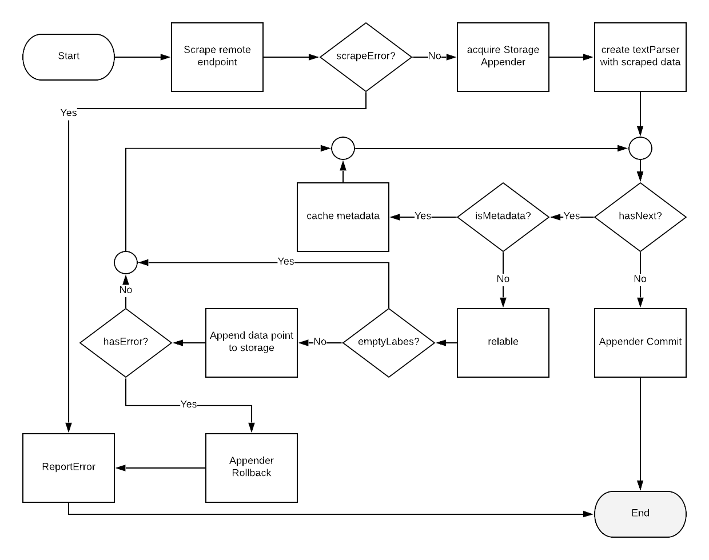

## Design Goals

### Provide a seamless onboarding experience for users who are already familiar with Prometheus scrape config

Prometheus has a very powerful config system for user to config how Prometheus
can scrape the metrics data from any application which expose a Prometheus
format metrics endpoint. It provides very useful features like filtering
unwanted metrics, relabeling tags, etc. The original Prometheus receiver of
OpenTelemetry took the approach of using Prometheus' own scraper's source code
as a library to achieve this goal. Overall the idea was great, however, the
original implementation has a lot of glitches, it cannot be fixed by small
patches. This new Prometheus receiver is going to follow the same idea of
leveraging Prometheus sourcecode, with a proper implementation.

### Map Prometheus metrics to the corresponding OpenTelemetry metrics properly

Prometheus receiver shall be able to map Prometheus metrics to OpenTelemetry's
proto based metrics, it shall respect the original metric name, value,
timestamp, as well as tags. It doesn't need to provide one-to-one mapping,
since supported metric types are different from the two systems.  However, it
shall not drop data.

### Parity between Prometheus and OpenTelemetry Prometheus exporter

Prometheus itself can also used as an exporter, that it can expose the metrics
it scrape from other system with its own metrics endpoint, so is OpenTelemetry
service. We shall be able to retain parity from the following two setups:

1. app -> prometheus -> metric-endpoint
2. app -> otelcol-with-prometheus-receiver -> otelcol-prometheus-exporter-metrics-endpoint


## Prometheus Text Format Overview

Prometheus text format is a line orient format. Each non-empty line, which
does not begin with #, is a metric data point with includes a metric name and its
value, which is of float64 type, as well as some optional data such as tags and
timestamp, which is in milliseconds. For lines that begin with #, they are either
comments, which need to be filtered, or metadata, including type hints
and units that are usually indicating the beginning of a new individual metric
or a group of new metrics. More details of Prometheus text format can be found
from its [official
document](https://prometheus.io/docs/instrumenting/exposition_formats/#text-based-format).

### Metric types
Based on this document, Prometheus supports the following 5 types of metrics:
* Counter
* Gauge
* Histogram
* Summary
* Untyped (untyped metrics are converted to `gauge` by default)

However, this is not the whole story, from the implementation details of
Prometheus scraper, which the receiver based on, it supports a couple more
undocumented metrics types, including:

* Gaugehistogram
* Info
* Statset

More details can be found from the
[prometheus text parser source code]( https://github.com/prometheus/prometheus/blob/master/pkg/textparse/interface.go#L82)

### Metric Grouping

Other than metric types, the type hint comment and metric grouping are also
important to know in order to parse Prometheus text metrics properly. From any
Prometheus metrics endpoints, metrics are usually grouped together by starting
with a comment section which includes some very important information like type
hints about the metrics, and metrics points of the same group will have the
same metric name but a different set of tag values, for example:

```
# HELP container_cpu_load_average_10s Value of container cpu load average over the last 10 seconds.
# TYPE container_cpu_load_average_10s gauge
container_cpu_load_average_10s{id="/",image="",name=""} 0
container_cpu_load_average_10s{id="/000-metadata",image="",name=""} 0
container_cpu_load_average_10s{id="/001-sysfs",image="",name=""} 0
```

The above example was taken from a cadvisor metric endpoint, the type hint
tells that the name of this metric group is `container_cpu_load_average_10s`
and it's of `gauge` type. Then it is followed by some individual metric points
which have the same metric name. For each individual metric within this
group, they share the same set of tag keys, with unique value sets.

## Prometheus Metric Scraper Anatomy

The metrics scraper is a component which is used to scrape remote Prometheus
metric endpoints, it is also the component which Prometheus receiver is based
on. It's important to understand how it works in order to implement the
receiver properly.

### Major components of Prometheus Scape package

- **[ScapeManager](https://github.com/prometheus/prometheus/blob/v2.9.2/scrape/manager.go):**
the component which loads the scrape_config, and manages the scraping tasks

- **[ScrapePool](https://github.com/prometheus/prometheus/blob/d3245f15022551c6fc8281766ea62db4d71e2747/scrape/scrape.go#L154-L439):**
an object which manages scrapes for a sets of targets

- **[Scraper](https://github.com/prometheus/prometheus/blob/d3245f15022551c6fc8281766ea62db4d71e2747/scrape/scrape.go#L506-L511):**
a http client to fetch data from remote metrics endpoints

- **[Target](https://github.com/prometheus/prometheus/blob/v2.9.2/scrape/target.go):**
the remote metric endpoint, as well as related relabeling settings and other metadata

- **[TextParser](https://github.com/prometheus/prometheus/tree/v2.9.2/pkg/textparse):**
a DFA style streaming decoder/parser for prometheus text format

- **[Appendable](https://github.com/prometheus/prometheus/blob/d3245f15022551c6fc8281766ea62db4d71e2747/scrape/manager.go#L37-L39):**
it is used to acquire a storage appender instance at the beginning of each scrapeLoop run

- **[storage.Appender](https://github.com/prometheus/prometheus/blob/d3245f15022551c6fc8281766ea62db4d71e2747/storage/interface.go#L86-L95):**
an abstraction of the metric storage which can be a filesystem, a database or a remote endpoint...etc. For the OpenTelemetry prometheus receiver, this is
also the interface we need to implement to provide a customized storage appender backed by a metrics sink.

- **[ScrapeLoop](https://github.com/prometheus/prometheus/blob/d3245f15022551c6fc8281766ea62db4d71e2747/scrape/scrape.go#L586-L1024):**
the actual scrape pipeline which performs the main scraping and ingestion logic.

### Prometheus ScrapeLoop workflow explained
Each scraping cycle is triggered by a configured interval, its workflow is as
shown in the flowchart below:



It basically does the following things in turn:

  1. make a http call to fetch data from the binding [target](#target)'s metrics endpoint with [scraper](#scraper)
  2. acquired a [storage appender](#storage-appender) instance with the [Appendable](#appendable) interface 
  3. feed the data to a textParser
  4. parse and feed metric data points to storage appender
  5. commit if success or rollback
  6. report task status

## Implementing Prometheus storage.Appender with metrics sink

### The storage.Appender interface
As discussed in the previous section, the storage.Appender is the most
important component for us to implement to bring the two worlds
together. It has a very simple interface which is defined below:

```go
type Appender interface {
  Append(ref uint64, l labels.Labels, t int64, v float64) (uint64, error)

  // Commit submits the collected samples and purges the batch.
  Commit() error

  Rollback() error

  ExemplarAppender
}

type ExemplarAppender interface {
	AppendExemplar(ref uint64, l labels.Labels, e exemplar.Exemplar) (uint64, error)
}
```

*Note: the above code belongs to the Prometheus project, its license can be found [here](https://github.com/prometheus/prometheus/blob/v2.26.0/LICENSE)*

One can see that the interface is very simple, it only has 4 methods (once we
account for the embedded `ExemplarAppender` interface): `Append`, `AppendExemplar`,
`Commit` and `Rollback`. The two lifecycle methods are easy to understand: `Commit`
is called when the processing of the scraped page is completed and successful,
whereas `Rollback` is called if an error occurs during the process.

However, for the two methods starting with 'Append', the behavior is somewhat
more complicated.  The documentation indicates that calls to 'Append' may return
an optional 'reference number' which may be used to add further samples in the
same or later transactions.  A reference value of `0` is used to indicate that
no such caching should occur.  The documentation indicates that current implementations
of `AppendExemplar` do not generate reference numbers and their doing so should
be considered erroneous and logged.  In our system we do not generate any reference
numbers and always return `0` from `Append` and `AppendExemplar` to skip caching.

### Challenges and solutions
Even though the definition of this interface is very simple, to
implement it properly is a bit challenging given that every time the
Append/AppendExemplar method is called it only provides the information about the
current data point. The context of what metric group this data point belonging
to is not provided; we have to keep track of it internally within the appender.
This is not the whole story, there are a couple other issues we need to
address, including:

1. Have a way to link the Target with the current appender instance

The labels provided to the Append/AppendExemplar methods do not include some target
specified information such as `job name` which is important in constructing the [Node
proto](https://github.com/census-instrumentation/opencensus-proto/blob/e2601ef16f8a085a69d94ace5133f97438f8945f/src/opencensus/proto/agent/common/v1/common.proto#L36-L51)
object of OpenTelemetry. The target object is not accessible from the Appender
interface, however, we can get it from the ScrapeManager, so when designing the
appender we need to have a way to inject the binding target into the appender
instance.

2. Group metrics from the same family together

In OpenTelemetry, metric points of the same name are usually grouped together
as one timeseries but different data points. It's important for the appender to
keep track of the metric family changes, and group metrics of the same family
together Keep in mind that the Append/AppendExemplar method is operated in a streaming
manner, ScrapeLoop does not provide any direct hints on metric name change, the
appender itself need to keep track of it. It's also important to know that for
some special types such as `histogram` and `summary`, not all the data points
have the same name, there are some special metric points has postfix like
`_sum` and `_count`, we need to handle this properly, and do not consider this
as a metric family change.

3. Group complex metrics such as histogram together in proper order

In Prometheus a single aggregated type of metric data such as `histogram` and
`summary` is represented by multiple metric data points, such as buckets and
quantiles, as well as the additional `_sum` and `_count` data. ScrapeLoop will
feed them into the appender individually. The appender needs to have a way to
bundle them together to transform them into a single Metric Datapoint Proto
object.

4. Tags need to be handled carefully

ScrapeLoop strips out any tag with empty value, however, in OpenTelemetry, the
tag keys is stored separately, we need to able to get all the possible tag keys
of the same metric family before committing the metric family to the sink.

5. StartTimestamp and values of metrics of cumulative types

In OpenTelemetry, every metric of cumulative type is required to have a
StartTimestamp, which records when a metric is first recorded. However,
Prometheus does not provide such data. One of the solutions to tackle this
problem is to cache the first observed value of these metrics as well as the
timestamp, then for any subsequent data of the same metric, use the cached
timestamp as StartTimestamp. Unfortunately, metrics can come and go, or the
remote server can restart at any given time, so the receiver also needs to
take care of issues such as when a new value is smaller than the previously
seen value, by considering it as a metric with a new StartTime.

## Prometheus Metric to OpenTelemetry Metric Proto Mapping

### Target as Node
The Target of Prometheus is defined by the scrape_config, it has information
such as the `hostname` of the remote service, and a user defined `job
name` that can be used as the service name. These two pieces of information
make it a great fit to map to the `Node` field of the OpenTelemetry
MetricsData type, as shown below:

```go
type MetricsData struct {
  Node     *commonpb.Node
  Resource *resourcepb.Resource
  Metrics  []*metricspb.Metric
}
```

The scrape page as a whole also can be fit into the above `MetricsData` data
structure, and all the metrics data points can be stored with the `Metrics`
array. We will explain the mappings of individual metric types in the following
sections

### Metric Value Mapping
 In OpenTelemetry metrics value types can be either `int64` or `float64`,
 while in Prometheus the value can be safely assumed to always be `float64`
 based on the [Prometheus Text Format
 Document](https://prometheus.io/docs/instrumenting/exposition_formats/#text-format-details),
 as quoted below:

> value is a float represented as required by Go's ParseFloat() function.
> In addition to standard numerical values, Nan, +Inf, and -Inf are valid
> values representing not a number, positive infinity, and negative infinity,
> respectively.

It will make sense for us to stick with this data type as much as possible
across all metrics types.

### Counter
Counter as described in the [Prometheus Metric Types
Document](https://prometheus.io/docs/concepts/metric_types/#counter),

> is a cumulative metric that represents a single monotonically increasing
> counter whose value can only increase or be reset to zero on restart.

It is one of the simplest metric types found in both systems, however, it is
a cumulative type of metric. Consider what happens when we have two consecutive
scrapes from a target, with the first one as shown below:
```
# HELP http_requests_total The total number of HTTP requests.
# TYPE http_requests_total counter
http_requests_total{method="post",code="200"} 1027
http_requests_total{method="post",code="400"}    3
```

and the 2nd one:
```
# HELP http_requests_total The total number of HTTP requests.
# TYPE http_requests_total counter
http_requests_total{method="post",code="200"} 1028
http_requests_total{method="post",code="400"}    5
```

The Prometheus Receiver stores previously seen scrape data as metadata to
attempt to identify value resets and to provide a start time for produced metrics.

The output of the first scrape is as shown below:
```go
metrics := []*metricspb.Metric{
  {
    MetricDescriptor: &metricspb.MetricDescriptor{
      Name:      "http_requests_total",
      Type:      metricspb.MetricDescriptor_CUMULATIVE_DOUBLE,
      LabelKeys: []*metricspb.LabelKey{{Key: "method"}, {Key: "code"}}},
    Timeseries: []*metricspb.TimeSeries{
      {
        StartTimestamp: startTimestamp,
        LabelValues:    []*metricspb.LabelValue{{Value: "post", HasValue: true}, {Value: "200", HasValue: true}},
        Points: []*metricspb.Point{
          {Timestamp: startTimestamp, Value: &metricspb.Point_DoubleValue{DoubleValue: 1027.0}},
        },
      },
      {
        StartTimestamp: startTimestamp,
        LabelValues:    []*metricspb.LabelValue{{Value: "post", HasValue: false}, {Value: "400", HasValue: true}},
        Points: []*metricspb.Point{
          {Timestamp: startTimestamp, Value: &metricspb.Point_DoubleValue{DoubleValue: 3.0}},
        },
      },
    },
  },
}
```

The output of the second scrape is as shown below:
```go
metrics := []*metricspb.Metric{
  {
    MetricDescriptor: &metricspb.MetricDescriptor{
      Name:      "http_requests_total",
      Type:      metricspb.MetricDescriptor_CUMULATIVE_DOUBLE,
      LabelKeys: []*metricspb.LabelKey{{Key: "method"}, {Key: "code"}}},
    Timeseries: []*metricspb.TimeSeries{
      {
        StartTimestamp: startTimestamp,
        LabelValues:    []*metricspb.LabelValue{{Value: "post", HasValue: true}, {Value: "200", HasValue: true}},
        Points: []*metricspb.Point{
          {Timestamp: currentTimestamp, Value: &metricspb.Point_DoubleValue{DoubleValue: 1028.0}},
        },
      },
      {
        StartTimestamp: startTimestamp,
        LabelValues:    []*metricspb.LabelValue{{Value: "post", HasValue: false}, {Value: "400", HasValue: true}},
        Points: []*metricspb.Point{
          {Timestamp: currentTimestamp, Value: &metricspb.Point_DoubleValue{DoubleValue: 5.0}},
        },
      },
    },
  },
}
```

*Note: `startTimestamp` is the timestamp cached from the first scrape, `currentTimestamp` is the timestamp of the current scrape*


### Gauge
Gauge, as described in the [Prometheus Metric Types Document](https://prometheus.io/docs/concepts/metric_types/#guage),
> is a metric that represents a single numerical value that can arbitrarily go up and down

```
# HELP gauge_test some test gauges.
# TYPE gauge_test gague
gauge_test{id="1",foo="bar"} 1.0
gauge_test{id="2",foo=""}    2.0

```

A major difference between Gauges of Prometheus and OpenTelemetry are the value
types. In Prometheus, as mentioned earlier, all values can be considered as
float type, however, in OpenTelemetry, Gauges can either be `Int64` or
`Double`. To make the transformation easier, we always assume the data type is
`Double`.

The corresponding OpenTelemetry Metric of the above examples will be:
```go
metrics := []*metricspb.Metric{
  {
    MetricDescriptor: &metricspb.MetricDescriptor{
      Name:      "gauge_test",
      Type:      metricspb.MetricDescriptor_GAUGE_DOUBLE,
      LabelKeys: []*metricspb.LabelKey{{Key: "id"}, {Key: "foo"}}},
    Timeseries: []*metricspb.TimeSeries{
      {
        StartTimestamp: nil,
        LabelValues:    []*metricspb.LabelValue{{Value: "1", HasValue: true}, {Value: "bar", HasValue: true}},
        Points: []*metricspb.Point{
          {Timestamp: currentTimestamp, Value: &metricspb.Point_DoubleValue{DoubleValue: 1.0}},
        },
      },
      {
        StartTimestamp: nil,
        LabelValues:    []*metricspb.LabelValue{{Value: "2", HasValue: true}, {Value: "", HasValue: false}},
        Points: []*metricspb.Point{
          {Timestamp: currentTimestamp, Value: &metricspb.Point_DoubleValue{DoubleValue: 2.0}},
        },
      },
    },
  },
}
```

### Histogram
Histogram is a complex data type, in Prometheus, it uses multiple data points
to represent a single histogram. Its description can be found from: [Prometheus
Histogram](https://prometheus.io/docs/concepts/metric_types/#histogram).

Similar to counter, histogram is also a cumulative type metric, so the receiver
will store metadata that can be used to detect resets and provide an appropriate
start timestamp for subsequent metrics.

An example of histogram with first scrape response:
```
# HELP hist_test This is my histogram vec
# TYPE hist_test histogram
hist_test_bucket{t1="1",,le="10.0"} 1.0
hist_test_bucket{t1="1",le="20.0"} 3.0
hist_test_bucket{t1="1",le="+inf"} 10.0
hist_test_sum{t1="1"} 100.0
hist_test_count{t1="1"} 10.0
hist_test_bucket{t1="2",,le="10.0"} 10.0
hist_test_bucket{t1="2",le="20.0"} 30.0
hist_test_bucket{t1="2",le="+inf"} 100.0
hist_test_sum{t1="2"} 10000.0
hist_test_count{t1="2"} 100.0

```

Its corresponding OpenTelemetry metrics will be:
```go
metrics := []*metricspb.Metric{
  {
    MetricDescriptor: &metricspb.MetricDescriptor{
      Name:      "hist_test",
      Type:      metricspb.MetricDescriptor_CUMULATIVE_DISTRIBUTION,
      LabelKeys: []*metricspb.LabelKey{{Key: "t1"}}},
    Timeseries: []*metricspb.TimeSeries{
      {
        StartTimestamp: startTimestamp,
        LabelValues:    []*metricspb.LabelValue{{Value: "1", HasValue: true}},
        Points: []*metricspb.Point{
          {Timestamp: startTimestamp, Value: &metricspb.Point_DistributionValue{
            DistributionValue: &metricspb.DistributionValue{
              BucketOptions: &metricspb.DistributionValue_BucketOptions{
                Type: &metricspb.DistributionValue_BucketOptions_Explicit_{
                  Explicit: &metricspb.DistributionValue_BucketOptions_Explicit{
                    Bounds: []float64{10, 20},
                  },
                },
              },
              Count:   10,
              Sum:     100.0,
              Buckets: []*metricspb.DistributionValue_Bucket{{Count: 1}, {Count: 2}, {Count: 7}},
            }}},
        },
      },
      {
        StartTimestamp: startTimestamp,
        LabelValues:    []*metricspb.LabelValue{{Value: "2", HasValue: true}},
        Points: []*metricspb.Point{
          {Timestamp: startTimestamp, Value: &metricspb.Point_DistributionValue{
            DistributionValue: &metricspb.DistributionValue{
              BucketOptions: &metricspb.DistributionValue_BucketOptions{
                Type: &metricspb.DistributionValue_BucketOptions_Explicit_{
                  Explicit: &metricspb.DistributionValue_BucketOptions_Explicit{
                    Bounds: []float64{10, 20},
                  },
                },
              },
              Count:   100,
              Sum:     10000.0,
              Buckets: []*metricspb.DistributionValue_Bucket{{Count: 10}, {Count: 20}, {Count: 70}},
            }}},
        },
      },
    },
  },
}
```

And a subsequent 2nd scrape response:
```
# HELP hist_test This is my histogram vec
# TYPE hist_test histogram
hist_test_bucket{t1="1",,le="10.0"} 2.0
hist_test_bucket{t1="1",le="20.0"} 6.0
hist_test_bucket{t1="1",le="+inf"} 13.0
hist_test_sum{t1="1"} 150.0
hist_test_count{t1="1"} 13.0
hist_test_bucket{t1="2",,le="10.0"} 10.0
hist_test_bucket{t1="2",le="20.0"} 30.0
hist_test_bucket{t1="2",le="+inf"} 100.0
hist_test_sum{t1="2"} 10000.0
hist_test_count{t1="2"} 100.0

```

Its corresponding OpenTelemetry metrics will be:
```go
metrics := []*metricspb.Metric{
  {
    MetricDescriptor: &metricspb.MetricDescriptor{
      Name:      "hist_test",
      Type:      metricspb.MetricDescriptor_CUMULATIVE_DISTRIBUTION,
      LabelKeys: []*metricspb.LabelKey{{Key: "t1"}}},
    Timeseries: []*metricspb.TimeSeries{
      {
        StartTimestamp: startTimestamp,
        LabelValues:    []*metricspb.LabelValue{{Value: "1", HasValue: true}},
        Points: []*metricspb.Point{
          {Timestamp: currentTimestamp, Value: &metricspb.Point_DistributionValue{
            DistributionValue: &metricspb.DistributionValue{
              BucketOptions: &metricspb.DistributionValue_BucketOptions{
                Type: &metricspb.DistributionValue_BucketOptions_Explicit_{
                  Explicit: &metricspb.DistributionValue_BucketOptions_Explicit{
                    Bounds: []float64{10, 20},
                  },
                },
              },
              Count:   13,
              Sum:     150.0,
              Buckets: []*metricspb.DistributionValue_Bucket{{Count: 2}, {Count: 4}, {Count: 7}},
            }}},
        },
      },
      {
        StartTimestamp: startTimestamp,
        LabelValues:    []*metricspb.LabelValue{{Value: "2", HasValue: true}},
        Points: []*metricspb.Point{
          {Timestamp: currentTimestamp, Value: &metricspb.Point_DistributionValue{
            DistributionValue: &metricspb.DistributionValue{
              BucketOptions: &metricspb.DistributionValue_BucketOptions{
                Type: &metricspb.DistributionValue_BucketOptions_Explicit_{
                  Explicit: &metricspb.DistributionValue_BucketOptions_Explicit{
                    Bounds: []float64{10, 20},
                  },
                },
              },
              Count:   100,
              Sum:     10000.0,
              Buckets: []*metricspb.DistributionValue_Bucket{{Count: 10}, {Count: 20}, {Count: 70}},
            }}},
        },
      },
    },
  },
}

```

There's an important difference between Prometheus bucket and OpenTelemetry
bucket that, bucket counts from Prometheus are cumulative, to transform this
into OpenTelemetry format, one needs to apply the following formula:

```
CurrentOCBucketVlaue = CurrentPrometheusBucketValue - PrevPrometheusBucketValue
```

OpenTelemetry does not use `+inf` as an explicit bound, one needs to remove it to generate
the Bounds of the OpenTelemetry distribution.

Other than that, the `SumOfSquaredDeviation`, which is required by
OpenTelemetry format for histogram, is not provided by Prometheus. We have to
set this value to `0` instead.

### Gaugehistogram

This is an undocumented data type, that's not currently supported.

### Summary

Same as histogram, summary is also a complex metric type which is represented by
multiple data points. A detailed description can be found from [Prometheus
Summary](https://prometheus.io/docs/concepts/metric_types/#summary)

The sum and count from Summary are cumulative, however, the quantiles are
not. The receiver will again maintain some state to attempt to detect value resets
and to set appropriate start timestamps.

For the following two scrapes, with the first one:

```
# HELP go_gc_duration_seconds A summary of the GC invocation durations.
# TYPE go_gc_duration_seconds summary
go_gc_duration_seconds{quantile="0"} 0.0001271
go_gc_duration_seconds{quantile="0.25"} 0.0002455
go_gc_duration_seconds{quantile="0.5"} 0.0002904
go_gc_duration_seconds{quantile="0.75"} 0.0003426
go_gc_duration_seconds{quantile="1"} 0.0023638
go_gc_duration_seconds_sum 17.391350544
go_gc_duration_seconds_count 52489
```

Its corresponding OpenTelemetry metrics will be:
```go
metrics := []*metricspb.Metric{
  {
    MetricDescriptor: &metricspb.MetricDescriptor{
      Name:      "go_gc_duration_seconds",
      Type:      metricspb.MetricDescriptor_SUMMARY,
      LabelKeys: []*metricspb.LabelKey{}},
    Timeseries: []*metricspb.TimeSeries{
      {
        StartTimestamp: startTimestamp,
        LabelValues:    []*metricspb.LabelValue{},
        Points: []*metricspb.Point{
          {Timestamp: startTimestamp, Value: &metricspb.Point_SummaryValue{
            SummaryValue: &metricspb.SummaryValue{
			  Sum:   &wrappers.DoubleValue{Value: 17.391350544},
			  Count: &wrappers.Int64Value{Value: 52489},
              Snapshot: &metricspb.SummaryValue_Snapshot{
                PercentileValues: []*metricspb.SummaryValue_Snapshot_ValueAtPercentile{
                  {Percentile: 0.0,   Value: 0.0001271},
                  {Percentile: 25.0,  Value: 0.0002455},
                  {Percentile: 50.0,  Value: 0.0002904},
                  {Percentile: 75.0,  Value: 0.0003426},
                  {Percentile: 100.0, Value: 0.0023638},
                },
              }}}},
        },
      },
    },
  },
}

```

And the 2nd one:
```
# HELP go_gc_duration_seconds A summary of the GC invocation durations.
# TYPE go_gc_duration_seconds summary
go_gc_duration_seconds{quantile="0"} 0.0001271
go_gc_duration_seconds{quantile="0.25"} 0.0002455
go_gc_duration_seconds{quantile="0.5"} 0.0002904
go_gc_duration_seconds{quantile="0.75"} 0.0003426
go_gc_duration_seconds{quantile="1"} 0.0023639
go_gc_duration_seconds_sum 17.491350544
go_gc_duration_seconds_count 52490
```

Its corresponding OpenTelemetry metrics will be:
```go
metrics := []*metricspb.Metric{
  {
    MetricDescriptor: &metricspb.MetricDescriptor{
      Name:      "go_gc_duration_seconds",
      Type:      metricspb.MetricDescriptor_SUMMARY,
      LabelKeys: []*metricspb.LabelKey{}},
    Timeseries: []*metricspb.TimeSeries{
      {
        StartTimestamp: startTimestamp,
        LabelValues:    []*metricspb.LabelValue{},
        Points: []*metricspb.Point{
          {Timestamp: currentTimestamp, Value: &metricspb.Point_SummaryValue{
            SummaryValue: &metricspb.SummaryValue{
			  Sum:   &wrappers.DoubleValue{Value: 17.491350544},
			  Count: &wrappers.Int64Value{Value: 52490},
              Snapshot: &metricspb.SummaryValue_Snapshot{
                PercentileValues: []*metricspb.SummaryValue_Snapshot_ValueAtPercentile{
                  {Percentile: 0.0,   Value: 0.0001271},
                  {Percentile: 25.0,  Value: 0.0002455},
                  {Percentile: 50.0,  Value: 0.0002904},
                  {Percentile: 75.0,  Value: 0.0003426},
                  {Percentile: 100.0, Value: 0.0023639},
                },
              }}}},
        },
      },
    },
  },
}

```

There are also some differences between the two systems. One difference is that
Prometheus uses `quantile`, while OpenTelemetry uses `percentile`.
Additionally, OpenTelemetry has optional values for `Sum` and `Count` of a
snapshot, however, they are not provided by Prometheus, and `nil` will be used
for these values.

Other than that, in some Prometheus client implementations, such as the Python
version, Summary is allowed to have no quantiles, in which case the receiver
will produce an OpenTelemetry Summary with Snapshot set to `nil`.

### Others

For any other Prometheus metrics types, they will be transformed into the
OpenTelemetry [Gauge](#gague) type.
